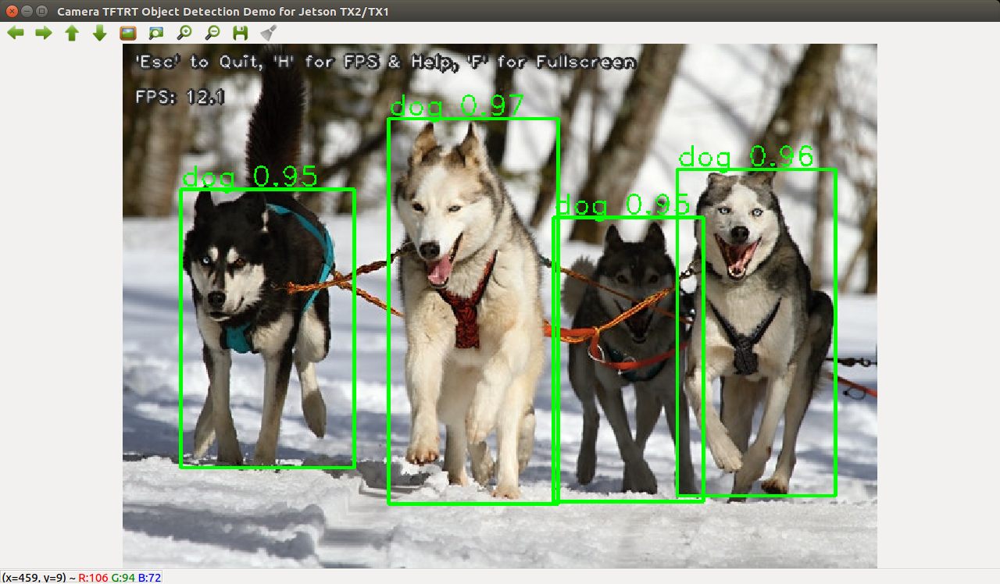

TensorFlow/TensorRT Models on Jetson
====================================

This repository was forked from NVIDIA's [tf_trt_models](https://github.com/NVIDIA-Jetson/tf_trt_models) repository.  It contains sctipts to optimize TensorFlow models with TensorRT, as well as scripts for testing/demo.  The models are sourced from the [TensorFlow models repository](https://github.com/tensorflow/models).  This repository mainly focuses on **object detection** models.

* [Setup](#setup)
* [Object Detection](#od)
  * [Models](#od_models)
  * [Real-time object detection with TensorRT optimized models](#rt_od)

<a name="setup"></a>
Setup
-----

Refer to this blog post for more details: [TensorFlow/TensorRT Models on Jetson TX2](https://jkjung-avt.github.io/tf-trt-modelsr/)

1. Flash your Jetson TX2 with JetPack 3.3 (including TensorRT).
2. Install OpenCV 3.4.x on Jetson.  Reference: [How to Install OpenCV (3.4.0) on Jetson TX2](https://jkjung-avt.github.io/opencv3-on-tx2/).
3. Download and install TensorFlow 1.10.0 (with TensorRT support).  Download link: [TensorFlow 1.10 wheel with JetPack 3.3](https://devtalk.nvidia.com/default/topic/1031300/jetson-tx2/tensorflow-1-8-wheel-with-jetpack-3-2-/).  Note that I use python3 for all my testing and development work.

   ```
   sudo pip3 install tensorflow-1.10.0-cp35-cp35m-linux_aarch64.whl
   ```

4. Clone this repository.

   ```
   cd ~/project
   git clone --recursive https://github.com/jkjung-avt/tf_trt_models
   cd tf_trt_models
   ```

5. Run the installation script.

   ```
   ./install.sh
   ```

<a name="od"></a>
Object Detection 
----------------

Please refer to the original [NVIDIA-Jetson/tf_trt_models](https://github.com/NVIDIA-Jetson/tf_trt_models) for code snippets which demonstrate how to download pretrained object detection models, how to build TensorFlow graph and how to optimize the models with TensorRT.

<a name="od_models"></a>
### Models

| Model                 | Input Size | TF-TRT TX2 | TF TX2 |
|:----------------------|:----------:|-----------:|-------:|
| ssd_mobilenet_v1_coco | 300x300    | ~70ms (?)  | 72.9ms |
| ssd_inception_v2_coco | 300x300    | ~70ms (?)  | 132ms  |

**TF** - Original TensorFlow graph (FP32)

**TF-TRT** - TensorRT optimized graph (FP16)

The above benchmark timings were gathered after placing the Jetson TX2 in MAX-N mode.  To do this, run the following commands in a terminal:

```
sudo nvpmodel -m 0
sudo ~/jetson_clocks.sh
```

<a name="rt_od"></a>
### Real-time object detection with TensorRT optimized models

The `camera_tf_trt.py` scripts supports video inputs from: (1) a video file, say mp4, (2) an image file, say jpg or png, (3) an RTSP stream from an IP CAM, (4) a USB webcam, (5) the Jetson onboard camera.  Check out its help message about how to invoke it with a specific video source.

```
$ python3 camera_tf_trt.py --help
usage: camera_tf_trt.py [-h] [--file] [--image] [--filename FILENAME] [--rtsp]
                        [--uri RTSP_URI] [--latency RTSP_LATENCY] [--usb]
                        [--vid VIDEO_DEV] [--width IMAGE_WIDTH]
                        [--height IMAGE_HEIGHT] [--model MODEL] [--build]
                        [--tensorboard] [--labelmap LABELMAP_FILE]
                        [--num-classes NUM_CLASSES] [--confidence CONF_TH]

This script captures and displays live camera video, and does real-time object
detection with TF-TRT model on Jetson TX2/TX1

optional arguments:
  -h, --help            show this help message and exit
  --file                use a video file as input (remember to also set
                        --filename)
  --image               use an image file as input (remember to also set
                        --filename)
  --filename FILENAME   video file name, e.g. test.mp4
  --rtsp                use IP CAM (remember to also set --uri)
  --uri RTSP_URI        RTSP URI, e.g. rtsp://192.168.1.64:554
  --latency RTSP_LATENCY
                        latency in ms for RTSP [200]
  --usb                 use USB webcam (remember to also set --vid)
  --vid VIDEO_DEV       device # of USB webcam (/dev/video?) [1]
  --width IMAGE_WIDTH   image width [1280]
  --height IMAGE_HEIGHT
                        image height [720]
  --model MODEL         tf-trt object detecion model [ssd_inception_v2_coco]
  --build               re-build TRT pb file (instead of usingthe previously
                        built version)
  --tensorboard         write optimized graph summary to TensorBoard
  --labelmap LABELMAP_FILE
                        [third_party/models/research/object_detection/data/msc
                        oco_label_map.pbtxt]
  --num-classes NUM_CLASSES
                        number of object classes [90]
  --confidence CONF_TH  confidence threshold [0.3]
```

The `--model` option only supports `ssd_inception_v2_coco` (default) and `ssd_mobilenet_v1` now.  It would probably be extended to support more object detection models in the future.  The `--build` option only needs to be done once for each object detection model.  The TensorRT optimized graph would be saved/cached into a protobuf file, so that later invocations of the script could load the cached graph directly without going through the optimization steps again.


Example #1: build TensorRT optimized 'ssd_mobilenet_v1_coco' model and run real-time object detection with USB webcam.

```
python3 camera_tf_trt.py --usb --model ssd_mobilenet_v1_coco --build`
```

Example #2: verify the optimized 'ssd_mobilenet_v1_coco' model with NVIDIA's original huskies picture. 

```
python3 camera_tf_trt.py --image --filename examples/detection/data/huskies.jpg --model ssd_mobilenet_v1_coco
```

Here is the result of example #2.

<p>

</p>
