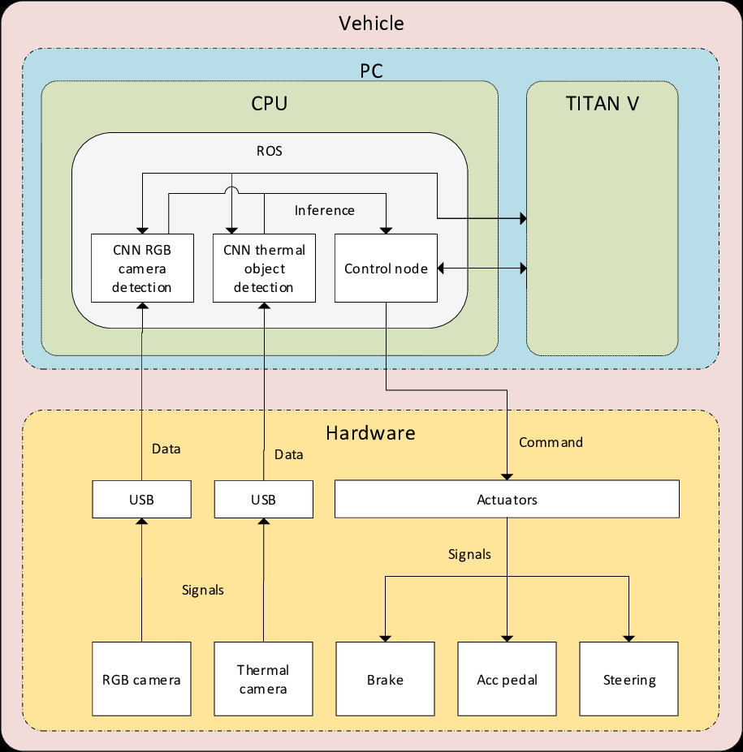

# Functional Safety Analysis

introduction:

current situation, our system embedded in the car

Hypothesis

structure of this analysis

## Assumptions

In order to make a valuable functional safety analysis of the thermal object detection system, multiple assumptions are made. 
- The thermal camera is mounted in the car, with clear view and waterproof design.
- Precision and recall is over 99%, so when an object is visible, we assume that it is detected correctly.
- The thermal object detection system is embedded in the PC on the computer and will be used as an inference for the control node. The figure below will show the architecture of the assumed system.

  

add visio image for assumed architecture

## Scenarios

where is the vehicle being tested and the analysis (which situations?)

when it fails what is the damage

## Limitations

wrt technology

## Risk Analysis

In order to have a clear understanding of the additional value of the thermal camera detection system in terms of functional safety, a risk analysis is made for possible risks and their severity levels. This analysis is done for the autonomous vehicle with the thermal camera connected, and without the thermal camera detected (RGB only). The assumption is made that the thermal camera is connected to the PC via a USB cable and the detection system is embedded in the ROS node of the PC. 

Automotive Safety Integrity Levels (explanation ASIL)

| Risk # | Explanation                                                  | Severity (RGB only) | Severity (RGB +thermal) | Exposure Probability | Hazard Probability (RGB only) | Hazard probability (RGB+thermal) |
| ------ | ------------------------------------------------------------ | ------------------- | ----------------------- | -------------------- | ----------------------------- | -------------------------------- |
| 1      | RGB camera USB cable to PC malfunction                       | 5                   | 1                       | 1                    | 1                             | 1                                |
| 2      | Missed object detection during bad weather conditions        | 5                   | 5                       | 2                    | 4                             | 1                                |
| 3      | Missed object detection during nighttime driving             | 5                   | 5                       | 2                    | 5                             | 1                                |
| 4      | RGB camera malfunction                                       | 5                   | 1                       | 1                    | 1                             | 1                                |
| 5      | Missed object detection due to light glare                   | 5                   | 5                       | 3                    | 4                             | 1                                |
| 6      | Incorrect classification due to occlusion                    | 2                   | 2                       | 5                    | 3                             | 2                                |
| 8      | incorrect classification in good weather                      | 2                   | 2                       | 4                    | 1                             | 1                                |
| 9      | incorrect classification because of bad weather                       | 2                   | 2                       | 2                    | 3                             | 1                                |
| 10     | incorrect classification because of light glare              | 2                   | 2                       | 3                    | 3                             | 1                                |
| 11     | incorrect classification because of nighttime driving                         | 2                   | 2                       | 2                    | 4                             | 1                                |
| 12     | Computer failure                                             | 5                   | 5                       | 1                    | 1                             | 1                                |
| 13     | Wrong x-y data of object sent to control node because of change in orientation of RGB camera | 5                   | 5                       | 1                    | 2                             | 1                                |
| 14     | Missed object detection due to change in orientation of RGB camera | 5                   | 5                       | 1                    | 2                             | 1                                |

#Put explanation and analysis here.

tell how incorrect/no classifications can happen (software based)

malfunction can happen due to short circuit or power supply failure

Risk analysis for RGB only

| Risk # | Explanation                                                  | Severity | Exposure | Controllability | ASIL level |
| ------ | ------------------------------------------------------------ | -------- | -------- | --------------- | ---------- |
| 1      | RGB camera USB cable to PC malfunction                       | S3       | E1       | C1              | QM         |
| 2      | Missed object detection because of bad weather conditions    | S3       | E4       | C3              | D          |
| 3      | Missed object detection because of nighttime driving         | S3       | E4       | C3              | D          |
| 4      | RGB camera malfunction                                       | S3       | E1       | C1              | QM         |
| 5      | Missed object detection because of light glare               | S3       | E4       | C3              | D          |
| 6      | Incorrect classification because of occlusion                | S1       | E3       | C3              | A          |
| 7      | Incorrect classification in good weather conditions          | S1       | E1       | C3              | QM         |
| 8      | Incorrect classification in bad weather conditions           | S1       | E4       | C3              | B          |
| 9      | Incorrect classification because of light glare              | S1       | E3       | C2              | QM         |
| 10     | Incorrect classification because of nighttime driving        | S1       | E4       | C3              | B          |
| 11     | Computer failure                                             | S3       | E1       | C1              | QM         |
| 12     | Wrong x-y data of object sent to control node because of change in orientation of RGB camera | S3       | E1       | C2              | QM         |
| 13     | Missed object detection due to change in orientation of RGB camera | S3       | E1       | C2              | QM         |

Analysis for RGB+thermal camera

| Risk # | Explanation                                                  | Severity | Exposure | Controllability | ASIL level |
| ------ | ------------------------------------------------------------ | -------- | -------- | --------------- | ---------- |
| 1      | RGB camera USB cable to PC malfunction                       | S1       | E1       | C1              | QM         |
| 2      | Missed object detection because of bad weather conditions    | S3       | E1       | C3              | A          |
| 3      | Missed object detection because of nighttime driving         | S3       | E1       | C3              | A          |
| 4      | RGB camera malfunction                                       | S1       | E1       | C1              | QM         |
| 5      | Missed object detection because of light glare               | S3       | E1       | C3              | A          |
| 6      | Incorrect classification because of occlusion                | S1       | E2       | C3              | A          |
| 7      | Incorrect classification in good weather conditions          | S1       | E1       | C3              | QM         |
| 8      | Incorrect classification in bad weather conditions           | S1       | E1       | C3              | QM         |
| 9      | incorrect classification because of light glare              | S1       | E1       | C3              | QM         |
| 10     | Incorrect classification because of nighttime driving        | S1       | E1       | C3              | QM         |
| 11     | Computer failure                                             | S3       | E1       | C1              | QM         |
| 12     | Wrong x-y data of object sent to control node because of change in orientation of RGB camera | S3       | E1       | C1              | QM         |
| 13     | Missed object detection due to change in orientation of RGB camera | S3       | E1       | C1              | QM         |