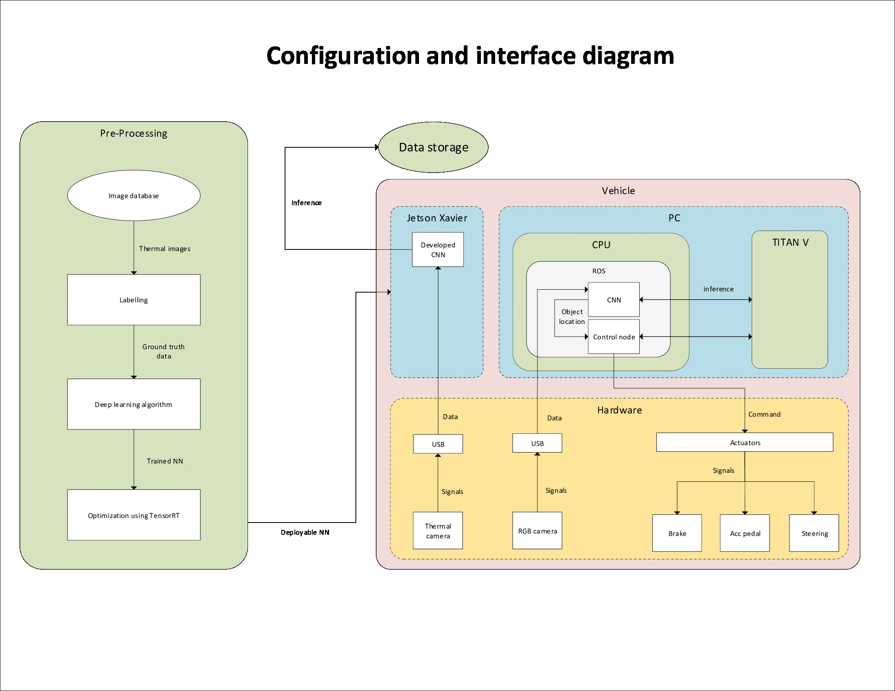

# Documentation

This document covers the systems architecture related work for this project. It consists of interface diagram, requirements engineering, stakeholder analysis and functional safety analysis. The goal of all this analyses is to ensure that the project scope stays feasible and relevant within the project timeline. The functional safety analysis is a direct requirement of the stakeholders as well. The interface diagram depicts the interactions between the various sub-systems - pre-processing, software and hardware. 

- [Stakeholder analysis](Stakeholder analysis.md)
- [Requirements](Requirements.md)
- [Functional safety analysis](Functional safety analysis.md)

## Scope of the project

The project scope is primarily limited to achieving inference of the mentioned classes from the object detection system. Additionally, outputting the inference in a standard format (as per the stakeholder requirements) so that it can be used further to control the relevant actuators is also within the scope of the project. Developing robust mounting systems for the camera and Jetson Xavier using 3D-printing is also an important part and lies within the project scope.

*Figure 1: Interface diagram of the object detection system*

## Software / System Architecture

As far as the architecture is concerned, we approached a very lean approach since the project has a short timeline. The main focus of software architecture for this project was to come up with SMART stakeholder requirements after having meetings with each stakeholder to note their concerns. The next step was to classify these requirements into feasible and less feasible based upon the project timeline and other limitations. A detailed functional safety analysis formed another crucial pillar of the software architecture work. This was done in accordance with ISO 26262. A clear configuration and interface diagram was prepared as a part of the architecture work to establish a common understanding about our system and how it is interacting with other systems in the car. No elaborate architecture framework like CAFCR was explicitly adopted but it was decided that all the sub-teams working on different aspects of the project shall follow a V-cycle approach in meeting their project deliverables.

