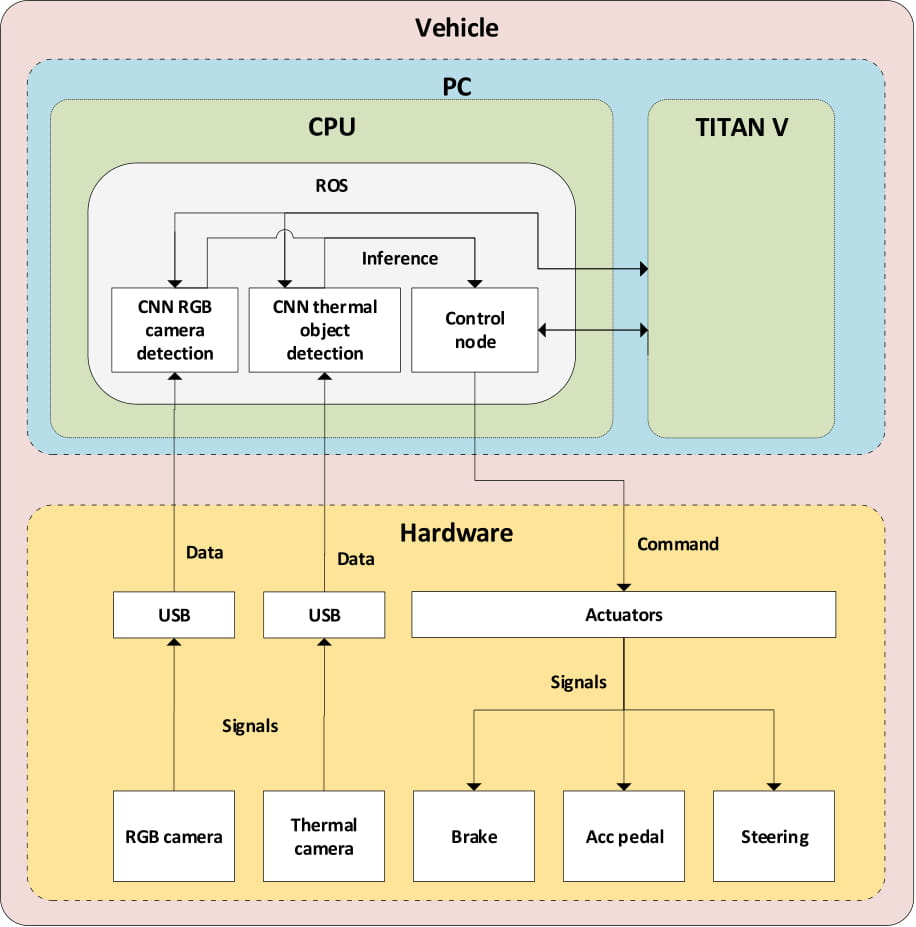
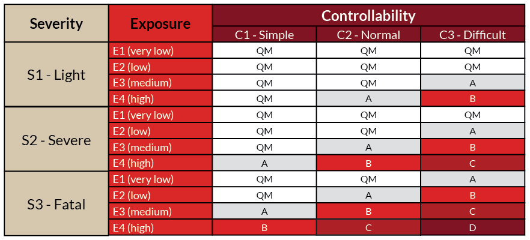

# Functional Safety Analysis

## List of Abbreviations

RGB = Red Green Blue

ASIL = Automotive Safety Integrity Levels

SAE = Society of Automotive Engineers

CPU = Central Processing Unit

ROS = Robot Operating System

GPU = Graphics Processing Unit

CNN = Convolutional Neural Network

GPS = Global Positioning System

ISO = International Organization of Standardization

## Introduction 

In order to give a clear idea about feasibility, risks and safety, a functional safety analysis is made for the object detection system. The main question that raised from the stakeholders' side was *what risks are present when using an object detection system containing only a RGB camera and how does adding a object detection system using a thermal camera mitigate these problems?* To answer this question, we designed a new , assumed, architecture and accuracy levels. Then the various scenarios are analysed and further elaborated. Finally a risk analysis is performed using the ASIL standards.

## Assumptions

In order to make a valuable functional safety analysis of the thermal object detection system, multiple assumptions are made. 
- The car is a SAE level 4 automated car ([SAE levels of automation](https://www.sae.org/news/press-room/2018/12/sae-international-releases-updated-visual-chart-for-its-"levels-of-driving-automation"-standard-for-self-driving-vehicles)), which will drive autonomously, but can send takeover requests to the driver if there is a failure in the system (e.g. malfunctioning camera's, PC malfunction). 
- The thermal camera is mounted in the car, with unobstructed view and waterproof design.
- Precision and recall is over 99%, so when an object is visible (within a range of 20 meters in front of the car, as this is a requirement), we assume that it is detected correctly.
- The thermal object detection system is embedded in the CPU on the computer and will be used as an inference for the control node. 
- The system does not have loss in communication or broken signals.

Figure 1 will show the architecture of the assumed system. The trained neural network for the thermal object detection system is deployed on the ROS node in the CPU of the vehicle, which will use the NVIDIA TITAN V GPU for speeding up calculations. In this system the NVIDIA Jetson Xavier is not needed anymore because the inference will now be directly sent to the control node, instead of saving it into a database. With this architecture it is assumed that the vehicle can drive fully autonomously with two object detection systems. These two systems send their inference to the control node and the control node will send signals to the actuators.

*Figure 1: assumed architecture for the functional safety analysis*

## Assumed Scenarios

The weather scenarios that are assumed in this analysis are *good weather* and *bad weather*. Bad weather contains situations where the human eye would have difficulties to have a clear view of the environment, like rain, snow or fog. Other scenarios are night-time driving and light glare from the sun. The assumption is made that the car is only driving on asphalted roads in the Netherlands, because in the Netherlands there are almost only these types of roads, plus when the car is driving autonomously it will choose a path determined by the GPS which will not contain any unpaved roads. It is assumed that the GPS alone is sufficient for the task of path planning.

## Limitations

Post defining integration of the assumed architecture and accuracy, there are a few limitations that need to be addressed for the functional safety analysis. Following is the list of limitations:

- Snow is taken into account in *bad weather* in the analysis, but the limitation is that the thermal camera has difficulties detecting cars that are standing still.
- Occlusion will still be a limiting factor for the object detection system. As there are two detection systems present in the assumed architecture, the chance of detecting objects with occlusion is slightly increased. 
- Objects with same temperature might not be detected using the thermal camera only. The RGB camera mitigates this problem during daytime, but in night-time conditions this is still a limiting factor. Examples are standing still cars.
- There will still be risk of failure of the PC or cables/cameras which will not be mitigated with our system.

## Risk Analysis

In order to have a clear understanding of the additional value of the thermal camera detection system in terms of functional safety, a risk analysis is made for possible risks and their severity levels. This analysis is done for the autonomous vehicle for the following cases: a.) both the thermal camera and RGB camera connected, and b.) standalone RGB camera connected to the car (RGB only). The assumption is made that the thermal camera is connected to the PC via a USB cable and the detection system is embedded in the ROS node of the PC (see image of the architecture above). 

The risk analysis which is made is based on the ASILs described in the functional safety standard [ISO26262](https://www.iso.org/standard/68383.html). The levels are based on severity (how much harm does the risk do to the driver or other traffic participants), exposure  (how often does the situation occur) and controllability (how capable is the driver to take over the control when a risk occurs). Figure 2 shows the ASILs in a table. 

*Figure 2: ASIL table based on its severity level, controllability level and exposure. QM means quality measured, A is the lowest ASIL and D is the highest, causing serious harm to participants when it happens. [Source](https://neweagle.net/blog/how-iso-26262-2018-update-affects-you/)*

The goal is to reduce the potential harm/ASIL to a more controllable risk in order to prove the stakeholders that the risk is mitigated by adding an object detection system based on thermal imaging (proof of concept). The explanation of the risks needs some more elaboration. This is listed below:

- A malfunction can happen because of a short circuit, power supply failure, overheating hardware.
- A missed object detection is an object which should be detected but is not. This can happen because of weather conditions, night-time driving or glare. The algorithm does not see enough features to detect and classify the object. 
- Incorrect classification means that an object is detected, but it was classified incorrectly. If the object detection algorithm sends the inference to the control node, it could be that the car acts differently on an object. For example, a car is detected as a person. The speed of a car is way higher, so when detecting it as a person it could be that the control algorithm calculates that it can perform certain movements without any risk, but in reality it is different.
- Change in orientation of the camera could happen when an object hits the camera, the driver accidently moves the camera or when driving on rough terrain. 

Table 1 shows the risk analysis for the object detection system using a RGB camera only. One thing to keep in mind is that the risks that are listed below are the risks that have differences when comparing the two systems (object detection system containing only a RGB camera and object detection system containing RGB and thermal camera). If all risks would be listed, most of them will be exactly the same because these risks will not be mitigated with addition of the thermal image-based object detection system. 

| Risk # | Explanation                                                  | Severity | Exposure | Controllability | ASIL level |
| ------ | ------------------------------------------------------------ | -------- | -------- | --------------- | ---------- |
| 1      | RGB camera USB cable to PC malfunction                       | S3       | E1       | C1              | QM         |
| 2      | Missed object detection because of bad weather conditions    | S3       | E4       | C3              | D          |
| 3      | Missed object detection because of night-time driving        | S3       | E4       | C3              | D          |
| 4      | RGB camera malfunction                                       | S3       | E1       | C1              | QM         |
| 5      | Missed object detection because of light glare               | S3       | E4       | C3              | D          |
| 6      | Incorrect classification because of occlusion                | S1       | E3       | C3              | A          |
| 7      | Incorrect classification in good weather conditions          | S1       | E1       | C3              | QM         |
| 8      | Incorrect classification in bad weather conditions           | S1       | E4       | C3              | B          |
| 9      | Incorrect classification because of light glare              | S1       | E3       | C2              | QM         |
| 10     | Incorrect classification because of night-time driving       | S1       | E4       | C3              | B          |
| 11     | Computer failure                                             | S3       | E1       | C1              | QM         |
| 12     | Wrong x-y data of object sent to control node because of change in orientation of RGB camera | S3       | E1       | C2              | QM         |
| 13     | Missed object detection due to change in orientation of RGB camera | S3       | E1       | C2              | QM         |

*Table 1: Risk analysis using the ASIL table for the object detection system using a RGB camera only*

Table 2 shows the analysis for the same risks, but then for the object detection system using both the RGB and thermal camera. 

| Risk # | Explanation                                                  | Severity | Exposure | Controllability | ASIL level |
| ------ | ------------------------------------------------------------ | -------- | -------- | --------------- | ---------- |
| 1      | RGB camera USB cable to PC malfunction                       | S1       | E1       | C1              | QM         |
| 2      | Missed object detection because of bad weather conditions    | S3       | E1       | C3              | A          |
| 3      | Missed object detection because of night-time driving        | S3       | E1       | C3              | A          |
| 4      | RGB camera malfunction                                       | S1       | E1       | C1              | QM         |
| 5      | Missed object detection because of light glare               | S3       | E1       | C3              | A          |
| 6      | Incorrect classification because of occlusion                | S1       | E2       | C3              | A          |
| 7      | Incorrect classification in good weather conditions          | S1       | E1       | C3              | QM         |
| 8      | Incorrect classification in bad weather conditions           | S1       | E1       | C3              | QM         |
| 9      | incorrect classification because of light glare              | S1       | E1       | C3              | QM         |
| 10     | Incorrect classification because of night-time driving       | S1       | E1       | C3              | QM         |
| 11     | Computer failure                                             | S3       | E1       | C1              | QM         |
| 12     | Wrong x-y data of object sent to control node because of change in orientation of RGB camera | S3       | E1       | C1              | QM         |
| 13     | Missed object detection due to change in orientation of RGB camera | S3       | E1       | C1              | QM         |

*Table 2: Risk analysis using the ASIL table for the object detection system using a RGB camera and a thermal camera*

Based on the ASIL letters the risks with ASIL D (numbers 2, 3 and 5) will be brought back to level A when including a object detection system with thermal camera. A lot of risks are hard to control, because missed detections are not noted by the algorithm so the car will not send a signal that the driver has to take over. Controllability of risks which contain orientation or malfunctioning problems are controllable because the car will send a notification to the driver that he or she has to take over. The exposure (probability) of a lot of risks is significantly lower in our system, because the thermal camera does not depend on weather conditions or light emission. Risk number 6 is the only risk that still has the same ASIL A. As with two detection sources the classification could be slightly better, occlusion is still hard to mitigate. 

## Conclusion 

One can draw the conclusion that when adding the assumed object detection system based on thermal images will lower the chance of the risks that occur with an object detection system using a RGB camera only. The ASIL D drops till A and all other ASILs drop to QM, except for the risk of incorrect classification because of occlusion. 

