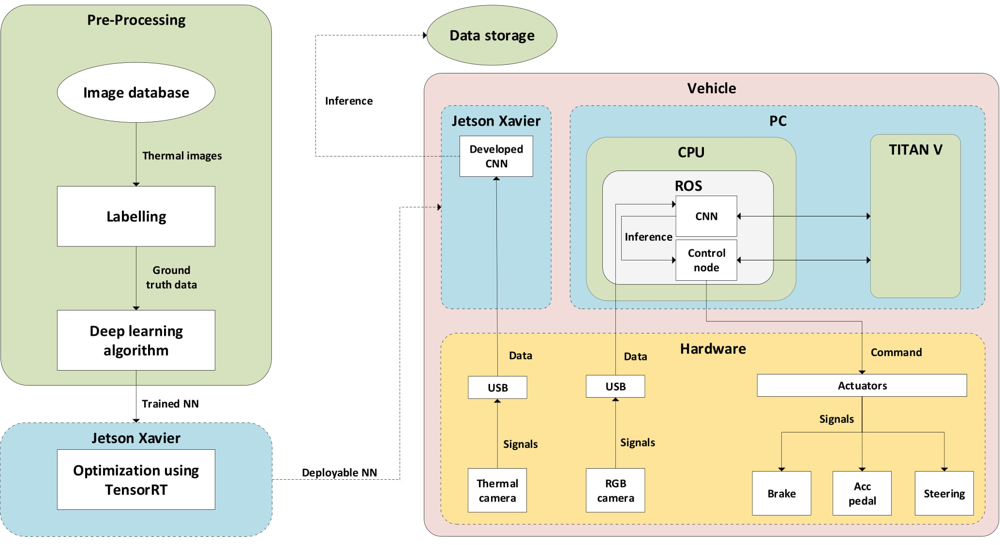

# Documentation

This document covers the systems architecture related work for this project. It consists of an interface diagram, requirements engineering, stakeholder analysis and functional safety analysis. The goal of these analyses is to ensure that the project scope stays feasible and relevant within the project timeline, and explain the stakeholders which risks are mitigated when adding an object detection system based on thermal images. The interface diagram depicts the interactions between the various subsystems, like pre-processing, software and hardware. 

- [Stakeholder analysis](Stakeholder_analysis.md)
- [Requirements](Requirements.md)
- [Functional safety analysis](Functional_safety_analysis.md)

## Scope of the project

The project scope is to make an object detection system where RGB cameras fail, using a thermal camera. Situations where object detection systems containing RGB images as an inference fail are night-time driving, bad weather conditions and glare from the sun or headlights from other cars. The project scope is primarily limited to achieving inference of the mentioned classes (car, bicycle, person) from the object detection system. The inference contains the x-y coordinates, bounding boxes and classification of the detected object. The object detection algorithm will be trained using labelled training data (thermal images with labelled objects) and the trained network will be deployed on a computing platform, which is a [NVIDIA Jetson Xavier AGX](https://developer.nvidia.com/embedded/jetson-agx-xavier-developer-kit). In order to meet speed requirements for online inferencing, the network needs to be optimized using [TensorRT](https://github.com/jkjung-avt/tensorrt_demos). The mounting systems for the camera and computing platform should be functional and will be developed using a 3D printing device. The total assembly of the system containing a thermal camera mounted on the roof of the car and a computing platform attached via a USB cable lies within the scope of this project as well. 

## System Architecture

Figure 1 shows the workflow and architecture of the object detection system. First pre-processing steps are executed, which consist of feeding labelled thermal images to the deep learning algorithm which will be trained accordingly. After training the neural network, the network will be deployed on the Jetson Xavier computing platform. The network will be optimized in terms of speed using [TensorRT](https://github.com/tue-mps-edu/thermal_object_detection/tree/master/tensorrt_optimization), in order to meet the stakeholders' requirements. The thermal camera will be connected to the Jetson Xavier via a USB cable. The Jetson Xavier will eventually provide inference which will be saved in the data storage. Both thermal camera and Jetson Xavier will be attached to the car using 3D printed mounting systems. The developed object detection system will not be embedded in the PC of the car, because there is a high dependency between the version in which the models are trained, and the version of TensorRT used for optimization. These are not matching as the versions of CUDA, ROS and Ubuntu in the PC of the car are not matching with the ones applicable in the Jetson Xavier. 

*Figure 1: Interface diagram of the object detection system*

As far as the software architecture is concerned, a very lean approach will be taken since the project has a short timeline. [SMART](https://en.wikipedia.org/wiki/SMART_criteria) requirements are derived from the system architecture and from having meetings with each stakeholder to note their main concerns. The next step will be to classify these requirements into feasible and less feasible based upon the project timeline and other limitations. A detailed functional safety analysis will be made in accordance with the [ISO26262](https://www.iso.org/standard/68383.html) functional safety standards. No elaborate architecture framework like [CAFCR](https://www.gaudisite.nl/ArchitecturalReasoning.html) will be executed because of the limitations in project size and timeline. All the subtasks will follow a V-cycle approach in meeting the project deliverables.

