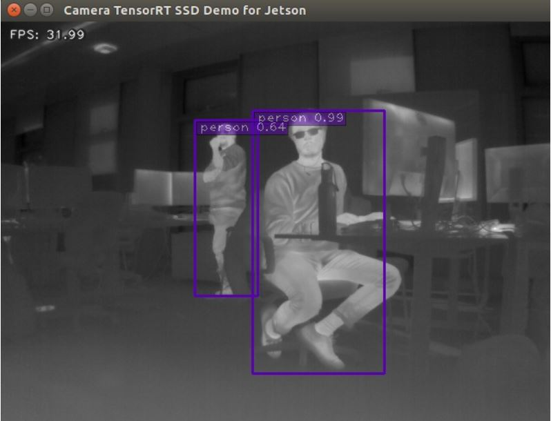

 System Integration
====================================

By this point, we'll assume a Neural Network model has been already [trained](../tensorflow_training/) and [optimized](../tensorrt/). However, before running the python script to perform online object detection on thermal images with the [Tau2 camera](../CAD/), we need to install a kernel module to the Jetson Xavier to interface with the camera as a regular device (E.g. /dev/video0).

First, we must install the libraries of the TeAx's Thermal Grabber. For this, run the installation script provided in this folder. This script will install some dependencies (if needed), and then compile the necessary libraries to interface with the Tau2. 

```
$ ./install.sh
```


Then, we load the kernel module. 

```
$ sudo modprobe v4l2loopback
```


Finally, we run the daemon to connect the module to the camera via TeAx's library.

```
$ sudo LD_PRELOAD=TCG_SDK_2018_02_14/libthermalgrabber/lib/libthermalgrabber.so ./TCGrabberUSBV4L2d /dev/video0
```

*Note: In order for this command to work, you must first verify the video device mounted by the kernel module in order to run the daemon correctly. This should match the videoX device in the command.*


After running this, you should see communication with the Tau2 camera. Some features are not enabled by default (This will lead to some error messages showing on screen), nevertheless, communication is still possible as long as the daemon is running.

Finally, we open a new terminal and run the object detector. The following command runs the object detector with the given model, model path, video device and confidence threshold. 


```
$ python3 trt_ssd.py --model ssd_mobilenet_v2_thermal --model_path ssd/TRT_ssd_mobilenet_v2_thermal --video /dev/video0 --conf_th 0.6
```


If everything goes well, you should be able to see online inference with the thermal camera feed on screen.


<center>
    
</center>

​    


