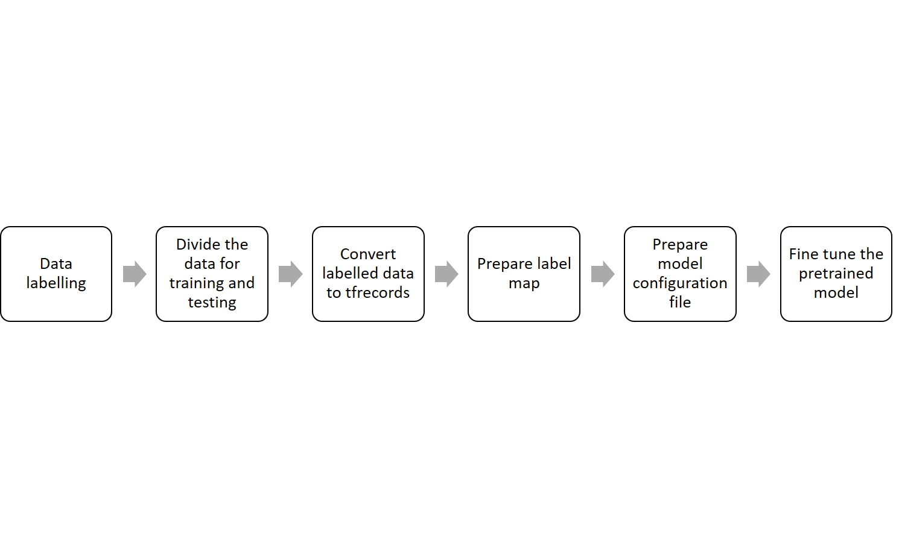
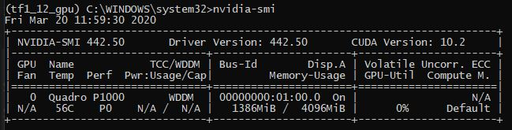

# TensorFlow Training

This part of the repository is based on [TensorFlow object detection API](https://github.com/tensorflow/models/tree/v1.12.0/research/object_detection) and a tutorial on [Custom Object Detection for Nvidia Jetson Nano](https://medium.com/swlh/nvidia-jetson-nano-custom-object-detection-from-scratch-using-tensorflow-and-opencv-113fe4dba134). This setup enables transfer learning with a set of pre-trained deep learning models built into the TensorFlow object detection API. Before you can start with the training, be sure to follow the steps and install all the dependencies from the main [README.md](../README.md). These guidelines work the same for both Linux as well as windows based machines. 

In supervised deep learning, the recorded data needs to be cleaned and labelled before it can be used for training. It is assumed here that the recorded data is already cleaned and ready for labelling.




*Figure 1: General workflow of TensorFlow training* 

## Data Split
As a first step, unannotated dataset needs to be divided into two subsets, namely training and testing. A training subset, as the name suggests, is used to train the model, while the test subset is used to test the trained model. Please note that the test subset is only used when the model is completely trained in order to evaluate its performance. As a general guideline, the complete dataset is divided into the subsets of  80% training and 20% testing. More information on this topic can be found at  [Training and Test Sets: Splitting Data](https://developers.google.com/machine-learning/crash-course/training-and-test-sets/splitting-data).

The divided data should then be kept in the [data](data/) directory. As an example, a Dummy_dataset in the required format is shown as follows 
 
```
data
 ├── Dummy_dataset
 │ ├── train
 │ ├── test
```

<em>Note: For reference, [data](data/) folder also includes datasets recorded during the project as well as thermal data set provided by Flir. </em>

## Data labelling
After the data is sorted as per [Data Split](#Datasplit), the data is now ready to be labelled. The most popular labelling formats used for object detection are Common Objects in Context (COCO) and Pascal Visual Object Classes(VOC), which are both suitable for this setup.COCO uses JSON format while Pascal VOC uses XML for the annotated data. The choice between the two is left to user discretion since these annotated files are ultimately converted to a cross-platform and cross-language binary format (TFRecord) as shown in Figure 1. 
 An example of an annotation XML file for an image in a Pascal VOC format is shown below.
```
<object>
	<name>fig</name>
	<pose>Unspecified</pose>
	<truncated>0</truncated>
	<difficult>0</difficult>
	<bndbox>
		<xmin>256</xmin>
		<ymin>27</ymin>
		<xmax>381</xmax>
		<ymax>192</ymax>
	</bndbox>
</object>
```

While an example of the annotation JSON file with data for one image in COCO format can be shown as follows.
```
{
  "type": "instances",
  "images": [
    {
      "file_name": "0.jpg",
      "height": 600,
      "width": 800,
      "id": 0
    }
  ]
  "categories": [
    {
      "supercategory": "none",
      "name": "date",
      "id": 0
    }
  ]
  "annotations": [
    {
      "id": 1,
      "bbox": [
        100,
        116,
        140,
        170
      ],
      "image_id": 0,
      "segmentation": [],
      "ignore": 0,
      "area": 23800,
      "iscrowd": 0,
      "category_id": 0
    }
  ]
}
```

As seen in the above examples, there is a significant difference between the two formats, which are: 

* Bounding boxes - 
The structure of the bounding boxes in Pascal VOC consists of an x and y coordinates of the top left and x and y coordinates of the bottom-right edge of the rectangle. On the other hand, the bounding box in COCO is the x and y coordinate of the top left and the height and width.
* Data storage - Annotations in COCO format generate a single JSON file for the whole dataset while Pascal VOC creates separate XML files per image.
* Label ID's - The classes in the COCO format (e.g. car, person, bike) have predefined ID numbers. To prevent issues, and to maintain consistency, the same ID's must be used if the class is already predefined in COCO standard. For additional classes, it is possible to add new IDs when needed. For the Pascal VOC format, the ID's can be freely defined.

Despite these differences, it should be noted that choosing either format does not impact model training. However, it has an impact on the tool you choose for labelling the data. For annotating the images in both the formats, several open-source softwares are available. As an example, [VGG Image Annotator](http://www.robots.ox.ac.uk/~vgg/software/via/) can be used for COCO annotations while [LabelImg](https://github.com/tzutalin/labelImg) can be used to annotate in PASCAL VOC format.   

It should be ensured that the images and their corresponding annotated files must have the same names when using the Pascal VOC format. The final folder for Pascal VOC should look like
```
data
 ├── Dummy_dataset
 │ ├── train
 │ │ ├── image_name_0.jpg
 │ │ ├── image_name_0.xml
 │ │ ├── ...
 │ │ ├── image_name_N.jpg
 │ │ ├── image_name_N.xml
 │ ├── test
 │ │ ├── image_name_0.jpg
 │ │ ├── image_name_0.xml
 │ │ ├── ...
 │ │ ├── image_name_N.jpg
 │ │ ├── image_name_N.xml
```

On the other hand, the final directory for datasets annotated in COCO format should look like 
```
data
 ├── Dummy_dataset
 │ ├── train
 │ │ ├── images_directory
 │ │ │ ├── image_name_0.jpg
 │ │ │ ├── ...
 │ │ │ ├── image_name_N.jpg
 │ │ ├── annotation_file.json
 │ ├── test
 │ │ ├── images_directory
 │ │ │ ├── image_name_0.jpg
 │ │ │ ├── ...
 │ │ │ ├── image_name_N.jpg
 │ │ ├── annotation_file.json
```

## Conversion to TFRecords
TFRecord is a binary cross-platform, cross-language format used for efficient serialization of structured data. On top of being cross-platform, TFRecords offers significant performance benefits  (e.g. faster read speeds, less storage) and has the ability to handle large datasets. As a result, TensorFlow uses TFRecords as its only supported input format. More information about the format can be found at [TFRecord and tf.Example](https://www.tensorflow.org/tutorials/load_data/tfrecord) and at [TensorFlow Records? What they are and how to use them](https://medium.com/mostly-ai/tensorflow-records-what-they-are-and-how-to-use-them-c46bc4bbb564).

To convert the [annotated data](#Data%20labelling) from the earlier steps, open terminal /command prompt and navigate to the `tensorflow_training` folder in the repository. Write the following command to initialize the virtual conda environment installed from the main [README.md](../).

```
$ conda activate tf1_12_gpu
```
Next, depending upon the labelling format, please follow the instructions either from `Only for the Pascal_VOC` section or from `Only for the COCO` section.

### Only for the Pascal_VOC 
For the Pascal_VOC format, issue the following command to generate TFRecord file for the annotated data. Please note that this command is an example which creates TFRecords for Dummy_dataset. The input path for your test and train directories needs to be configured before issuing this command.  

```
$  python supporting_scripts/xml_tfrecord.py --xml_input=data/Dummy_dataset/test/  --output_path=tfrecords/test_tfr/test.record

$  python supporting_scripts/xml_tfrecord.py --xml_input=data/Dummy_dataset/train/  --output_path=tfrecords/train_tfr/train.record
```

where,

`xml_input` = Relative path to test/ train directory containing images and corresponding XML files. 

`output_path`= This is the output path for the generated TFRecords file. User doesn't need to change this path.

The generated TFRecord files can be found inside [tfrecords](tfrecords/) folder. You can now proceed to the next section in order to create a [Label map](#Labelmap).

### Only for the COCO 
For the COCO format, issue the following command to generate TFRecord file for the annotated data. Please note that this command is an example which creates TFRecords for Flir dataset. The input path for your test and train directories needs to be configured before issuing this command. 

```
$  python json_tfrecord.py --input_image_dir=data/Flir/test/thermal_8_bit --input_annotations_file=data/Flir/test/thermal_annotations.json --output_dir=tfrecords/test_tfr/test.record

$  python json_tfrecord.py --input_image_dir=data/Flir/train/thermal_8_bit --input_annotations_file=data/Flir/train/thermal_annotations.json --output_dir=tfrecords/train_tfr/train.record
```

where,

`input_image` = Relative path to test/ train directory containing images.

`input_annotations_file`=  Relative path to test/ train directory containing JSON annotation file.

`output_dir`= This is the output path for the generated TFRecords file. User doesn't need to change this path.

The generated TFRecord files can be found inside [tfrecords](tfrecords/) folder. You can now proceed to the next section in order to create a [Label map](#Labe%20lmap)

## Label map

After [generating TFRecords](#Conversion%20to%20TFRecords) for test and train data, the next step is to create a label map associated with the dataset. This label map defines a mapping from string class names to integer class ID's. It should include all the classes included in the annotated data. As an important note, TensorFlow can only read label maps starting from Id 1.
 A sample label map is shown as follows.
```
item {
    id: 1
    name: 'Car'
}
item {
    id: 2
    name: 'Person'
}
```

These maps can be created and edited using any text editor. However, they must be saved as .pbtxt file instead of .txt file. The map should be placed in [label_map](label_map/) folder. A sample file of the label map is provided in the same folder.

## Model configuration

As a next step, you need to download the pre-trained models that you want to use as a base model for our training. Download links of all the supported models can be located at [pre-trained models for TensorFlow](https://github.com/tensorflow/models/blob/master/research/object_detection/g3doc/detection_model_zoo.md). Once the model is downloaded, unzip the model and place it in the [pretrained_baseline_google_models](pretrained_baseline_google_models/) folder. As an example, a ssd_mobilenet_v2 model is shown below to illustrate the final outcome of this step.
```
pretrained_baseline_google_models
 ├── ssd_mobilenet_v2_coco_2018_03_29
 │ ├── saved_model
 │ ├── checkpoint
 │ ├── frozen_inference_graph.pb
 │ ├── model.ckpt.data-00000-of-00001
 │ ├── model.ckpt.index
 │ ├── model.ckpt.meta
 │ ├── pipeline.config
```

<em>**Note: For reference, [pretrained_baseline_google_models](pretrained_baseline_google_models/) folder already includes  base models for ssd_mobilenet_v2_coco and aster_rcnn_inception_v2_coco. You need to do this step only when you need to use different models other than stated.**</em>

To configure the training and evaluation process of the model discussed earlier, TensorFlow object detection API uses a configuration file. At a high level, the configuration file is split into five parts: 
* `model configuration` - This defines what type of model will be trained (i.e. meta-architecture, feature extractor).
* `train_config` - This decides what parameters should be used to train model parameters (i.e. Stochastic gradient descent parameters, input preprocessing and feature extractor initialization values).
* `eval_config` - This determines what set of metrics will be reported for evaluation.
* `train_input_config` - This defines what dataset the model should be trained on.
* `eval_input_config` - This defines what dataset the model will be evaluated on. Typically this should be different than the training input dataset.


The skeleton of configuration file is shown below
```
model {
(... Add model config here...)
}

train_config : {
(... Add train_config here...)
}

train_input_reader: {
(... Add train_input configuration here...)
}

eval_config: {
}

eval_input_reader: {
(... Add eval_input configuration here...)
}
```

Depending on the model to be trained (e.g MobileNet v2, ResNET), a corresponding sample file for model configuration should be downloaded from [object detection sample configs](https://github.com/tensorflow/models/tree/v1.12.0/research/object_detection/samples/configs) and placed in [model_config](model_config/) folder.The configuration file has .config extension and can be edited with any simple text editor. The configuration file for ssd_mobilenet_v2_coco is already provided in the [model_config](model_config/) as an example.

This configuration file allows us to tweak several hyperparameters of the model such as batch size, number of classes, number of epochs, optimizers, learning rate dropout and data augmentation. For transfer learning, `train_input_config`, `eval_config` and `eval_input_config` are essential since you need to provide relevant paths to TFRecords, label maps and base models in these sections. To elaborate further, the aforementioned sections of a configuration file for SSD MobileNet v2 are shown below as an example. 

```
train_config: {
  batch_size: 24
  optimizer {
    rms_prop_optimizer: {
      learning_rate: {
        exponential_decay_learning_rate {
          initial_learning_rate: 0.004
          decay_steps: 800720
          decay_factor: 0.95
        }
      }
      momentum_optimizer_value: 0.9
      decay: 0.9
      epsilon: 1.0
    }
  }
  fine_tune_checkpoint: "PATH_TO_BE_CONFIGURED/model.ckpt"
  fine_tune_checkpoint_type:  "detection"
  # Note: The below line limits the training process to 200K steps, which we
  # empirically found to be sufficient enough to train the pets dataset. This
  # effectively bypasses the learning rate schedule (the learning rate will
  # never decay). Remove the below line to train indefinitely.
  num_steps: 200000
  data_augmentation_options {
    random_horizontal_flip {
    }
  }
  data_augmentation_options {
    ssd_random_crop {
    }
  }
}
```

For the above section, you need to add the absolute path to the model placed in [pretrained_baseline_google_models](pretrained_baseline_google_models/) folder to the following line -

 fine_tune_checkpoint: "PATH_TO_BE_CONFIGURED/model.ckpt"

This allows us to load a pre-trained model as a base for our training. It is essential to know that most of this model is "frozen" in the sense that their weights won't change as you train the model with our data. Since layers only specific to a class such as a feature extractor layer are getting trained while retaining the weights in frozen layers, this parameter allows us to fine-tune the model to our use case.    

```
train_input_reader: {
  tf_record_input_reader {
    input_path: "PATH_TO_BE_CONFIGURED/tfrecords/train_tfr/train.record"
  }
  label_map_path: "PATH_TO_BE_CONFIGURED/label_map.pbtxt"
}
```

Furthermore, you need to provide an absolute path to the train TFRecord file located at [tfrecords](tfrecords/) folder to the `eval_input_reader` section shown above.

input_path: "PATH_TO_BE_CONFIGURED/tfrecords/train_tfr/train.record"

You also need to add a path to the label map file placed [label_map](label_map/) folder in this section of the configuration file.

 label_map_path: "PATH_TO_BE_CONFIGURED/label_map.pbtxt"

```
eval_config: {
  num_examples: 8000
  # Note: The below line limits the evaluation process to 10 evaluations.
  # Remove the below line to evaluate indefinitely.
  max_evals: 10
}
eval_input_reader: {
  tf_record_input_reader {
    input_path: "PATH_TO_BE_CONFIGURED/tfrecords/test_tfr/test.record"
  }
  label_map_path: "PATH_TO_BE_CONFIGURED/label_map.pbtxt"
  shuffle: false
  num_readers: 1
}
```
In the `eval_config` section shown above, the parameter `num_examples` should be equal to total number test images based on your [data split](#Data%20Split). Finally, you need to provide an absolute path to the test TFRecord file located at [tfrecords](tfrecords/) to the `eval_input_config` section shown above.

input_path: "PATH_TO_BE_CONFIGURED/tfrecords/train_tfr/train.record"

You also need to add the path to the same label map file used earlier located in the [label_map](label_map/) folder.

label_map_path: "PATH_TO_BE_CONFIGURED/label_map.pbtxt"

After making all the changes above save the file, and now you are ready to start training.

## Model training

Before starting with the training please recheck the setup with the following check list:

- [tfrecords](tfrecords/) folder includes TFRecords file for both train and test sets
- [label_map](label_map/) includes the correct label_map.pbtxt file
- [pretrained_baseline_google_models](pretrained_baseline_google_models/) includes correct base model 
- [model_config](model_config/) includes correct configuration file saved with all the changes made in [Model configuration](#Model-configuration)
- Please make sure that the [model_evalulation](model_evalulation/), [model_frozen_inference_graph](model_frozen_inference_graph/), [model_training_checkpoints](model_training_checkpoints/) folders are empty and do not contain any files from earlier trainings.

If everything is in order, open terminal /command prompt and navigate to the `tensorflow_training` folder in the repository.  Initialize the virtual conda environment by

```
$ conda activate tf1_12_gpu
```

To start the training, 

```
$ python train.py --logtostderr --train_dir=model_training_checkpoints/ --pipeline_config_path=model_config/ssd_mobilenet_v2_coco.config
```
where,

`train_dir` = This is the directory where new training checkpoints will be saved. User does not need to change this value.

`pipeline_config_path`= This is the path to configuration file saved in [model_config](model_config/).The above command includes path to an ssd_mobilenet_v2_coco.config file as an example. However, it should be changed when training with a different configuration.

If successful, you should see the following result on the screen
```
INFO:tensorflow:Running local_init_op.
INFO:tensorflow:Running local_init_op.
INFO:tensorflow:Done running local_init_op.
INFO:tensorflow:Done running local_init_op.
INFO:tensorflow:Starting Session.
INFO:tensorflow:Starting Session.
INFO:tensorflow:Saving checkpoint to path C:/models-1.12.0/research/object_detection/model_for_training/Model_Inference_trial/model.ckpt
INFO:tensorflow:Saving checkpoint to path C:/models-1.12.0/research/object_detection/model_for_training/Model_Inference_trial/model.ckpt
INFO:tensorflow:Starting Queues.
INFO:tensorflow:Starting Queues.
INFO:tensorflow:global_step/sec: 0
INFO:tensorflow:global_step/sec: 0
INFO:tensorflow:Recording summary at step 0.
INFO:tensorflow:Recording summary at step 0.
INFO:tensorflow:global step 1: loss = 19.4835 (20.271 sec/step)
INFO:tensorflow:global step 1: loss = 19.4835 (20.271 sec/step)
INFO:tensorflow:global step 2: loss = 18.9409 (1.634 sec/step)
INFO:tensorflow:global step 2: loss = 18.9409 (1.634 sec/step)
INFO:tensorflow:global step 3: loss = 18.8032 (1.925 sec/step)
```

While the model is training, it is possible to visualize various metrics such as loss, accuracy, histograms of weights and biases and model graphs. Full documentation on tensorbaord can be found at [Tensorboard_guide](https://www.tensorflow.org/tensorboard/get_started). To initiate the tensorboard, start an additional instance of terminal /command prompt and navigate to the `tensorflow_training` folder in the repository. Run the following commands to activate the conda virtual environment and run tensorboard.

```
$ conda activate tf1_12_gpu
$ tensorboard --logdir=model_training_checkpoints/
```
where,

`logdir` = This is the directory where the model is saving new checkpoints during the training.The User does not need to change this path.

<em>Note: Tesnorboard can sometimes fail to load.Please use the following command instead to initiate the tensorboard.
```
$ conda activate tf1_12_gpu
$ tensorboard --logdir=model_training_checkpoints/ -host localhost --port 8088
```
</em>

Since the training can be computationally intensive, to see the resource allocation, start a new instance of the terminal/ command prompt and run the following
```
$ nvidia-smi -l 100
```
You should see the following panel. Note that the panel automatically refreshes every 100 seconds.



*Figure 2: Nvidia resource monitoring panel* 

Once the training is finished, navigate to [model_training_checkpoints](model_training_checkpoints/) and confirm if you see similar results to what is shown below. 

```
tensorflow_training
 ├── model_training_checkpoints
 │ ├── events.out.(filename)
 │ ├── graph.pbtxt
 │ ├── checkpoint
 │ ├── model.ckpt.data-00000-of-00001
 │ ├── model.ckpt.index
 │ ├── model.ckpt.meta
 │ ├── ...
 │ ├── (multiple intermediate model checkpoint files)
 │ ├── ...
 │ ├── model.ckpt-(Total number of steps).data-00000-of-00001
 │ ├── model.ckpt-(Total number of steps).index
 │ ├── model.ckpt-(Total number of steps).meta
 │ ├── pipeline.config
```

The model is now successfully trained with the new data!

## Model evaluation
Before you can evaluate the model, you have to make sure that the the weights in the model will not get updated any further during the evaluation process i.e. you have to freeze the model layers. It is also essential for further optimization using TensorRT for Jetson Xavier. In order to freeze the model, open a terminal/ command prompt and navigate to the `tensorflow_training` folder in the repository and run the following command.

```
$ conda activate tf1_12_gpu

$ python export_inference_graph.py --input_type image_tensor --pipeline_config_path model_config/ssdlite_mobilenet_v2_coco.config --trained_checkpoint_prefix model_training_checkpoints/model.ckpt-XXXX --output_directory model_frozen_inference_graph/
```
where,

`pipeline_config_path`= This is the path to configuration file saved in [model_config](model_config/).The above command includes the path to a ssd_mobilenet_v2_coco.config file as an example. However, it should be changed when training with a different configuration.

`trained_checkpoint_prefix`= This is the path to the model checkpoint which you want to freeze.As an example if you want to freeze the model with data at 50000 steps the input should look like model_training_checkpoints/model.ckpt-50000.

`output_directory inference_graph`= This is the path where the frozen model will be exported.

As an output, you get a frozen inference graph file with a .pb extension. This can be then used as a input for further optimizations using TensorRT in [tensorrt](../tensorrt/) section of this repository. The final frozen graph can be found in the [model_frozen_inference_graph](model_frozen_inference_graph/) folder.

Once you have the frozen graph ready, its possible to evaluate the model against the test data in order to determine its mAP(mean Average Precision) value. To initiate the evaluation, start an instance of terminal /command prompt and navigate to the `tensorflow_training` folder in the repository and run the following command

```
$ conda activate tf1_12_gpu

$ python eval.py --logtostderr --checkpoint_dir=model_training_checkpoints/ -- eval_dir=model_evalulation/ --pipeline_config_path=model_config ssdlite_mobilenet_v2_coco.config
```
where,

`checkpoint_ dir` = This is the path to the folder where model checkpoints are saved. Users don't need to change this input.

`eval_dir`= This the directory where the mAP results will saved. Users do not need to change this input.

`pipeline_config_path`= This is the path to the configuration file saved in [model_config](model_config/).The above command includes path to a ssd_mobilenet_v2_coco.config file as an example. However, it should be changed when training with a different configuration.
  
As an output you will see mAP score for the entire dataset and each class in both tensorboard and command prompt. An example of how the end result will look like is shown below

```
INFO:tensorflow:# success: 1366
INFO:tensorflow:# success: 1366
INFO:tensorflow:# skipped: 0
INFO:tensorflow:# skipped: 0
INFO:tensorflow:Writing metrics to tf summary.
INFO:tensorflow:Writing metrics to tf summary.
INFO:tensorflow:Losses/Loss/classification_loss: 3.204588
INFO:tensorflow:Losses/Loss/classification_loss: 3.204588
INFO:tensorflow:Losses/Loss/localization_loss: 1.455510
INFO:tensorflow:Losses/Loss/localization_loss: 1.455510
INFO:tensorflow:PascalBoxes_PerformanceByCategory/AP@0.5IOU/b"b'bicycle'": 0.179572
INFO:tensorflow:PascalBoxes_PerformanceByCategory/AP@0.5IOU/b"b'bicycle'": 0.179572
INFO:tensorflow:PascalBoxes_PerformanceByCategory/AP@0.5IOU/b"b'car'": 0.584676
INFO:tensorflow:PascalBoxes_PerformanceByCategory/AP@0.5IOU/b"b'car'": 0.584676
INFO:tensorflow:PascalBoxes_PerformanceByCategory/AP@0.5IOU/b"b'person'": 0.339082
INFO:tensorflow:PascalBoxes_PerformanceByCategory/AP@0.5IOU/b"b'person'": 0.339082
INFO:tensorflow:PascalBoxes_Precision/mAP@0.5IOU: 0.367777
INFO:tensorflow:PascalBoxes_Precision/mAP@0.5IOU: 0.367777
INFO:tensorflow:Metrics written to tf summary.
INFO:tensorflow:Metrics written to tf summary.
INFO:tensorflow:Finished evaluation!
INFO:tensorflow:Finished evaluation!
```

## Additional information
The frozen graph can also be tested with jupyter notebook object_detection_demo.ipynb file located in[supporting_scripts](supporting_scripts/). To run the script start an instance of terminal /command prompt and navigate to the `tensorflow_training` folder in the repository and run the the following commends 
```
$ cd supporting_scripts

$ conda activate tf1_12_gpu

$ jupyter notebook
```

This will open a new tab in your browser. Just double-click on object_detection_demo.ipynb and you will able to access the script in jupyter notebook environment. Before running the script, you need to specify relative path to frozen inference graph, label map and image set which you want to test on. The results will be shown in the browser in the form of images and predicted bounding boxes.  

