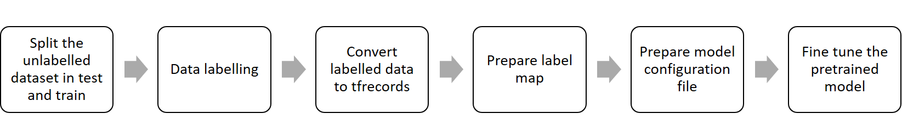

## Tensorflow Training

This repository is based on [tensorflow object detection API](https://github.com/tensorflow/models/tree/v1.12.0/research/object_detection) and a tutorial on [Custom Object Detection for Nvidia Jetson Nano](https://medium.com/swlh/nvidia-jetson-nano-custom-object-detection-from-scratch-using-tensorflow-and-opencv-113fe4dba134). This setup enables transfer learning with a set of pre-trained deep learning models built into the tensorflow object detection API. Before you can start with the training, be sure to follow the steps and install all the dependencies from the main [README.md](../). 

In supervised deep learning, the recorded data needs to be cleaned and labelled before it can be used for training. It is assumed here that the recorded data is already cleaned and ready for labelling.




*Figure 1: General workflow of tensorflow training* 

## Data Split
As a first step, unannotated dataset needs to be divided into two subsets namely training and testing. A training subset, as the name suggests, is used to train the model, while test subset is used to test the trained model.Please note that test subset is only used when the model is completely trained in order to evaluate its performance. As a general guideline, the complete dataset is divided into the subsets of  80% training and 20% testing. More information on this topic can be found at  [Training and Test Sets: Splitting Data](https://developers.google.com/machine-learning/crash-course/training-and-test-sets/splitting-data).

The divided data should then be kept in the [data](data/) directory. As an example a Dummy_dataset in the required format is showm as follows 
 
```
data
 ├── Dummy_dataset
 │ ├── train
 │ ├── test
```

<em>Note: For reference, [data](data/) folder also includes datasets recorded during the project as well thermal data set provided by Flir. </em>

## Data labelling
After the data is sorted as per [Data Split](#Datasplit), we can now proceed to label the data. The most popular labelling formats used for object detection are Common Objects in Context (COCO) and Pascal Visual Object Classes(VOC) which are both suitable for this setup.COCO uses JSON format while Pascal VOC uses XML for the annotated data. The choice between the two is left to user discretion, since these annotated files are ultimately converted to a cross-platform and cross-language binary format(TFRecord) as shown in Figure 1. 
An example of annotation XML file for a image in a Pascal VOC format is shown below.
```
<object>
	<name>fig</name>
	<pose>Unspecified</pose>
	<truncated>0</truncated>
	<difficult>0</difficult>
	<bndbox>
		<xmin>256</xmin>
		<ymin>27</ymin>
		<xmax>381</xmax>
		<ymax>192</ymax>
	</bndbox>
</object>
```

While an example of annotation JSON file with data for one image in COCO format can be shown as follows.
```
{
  "type": "instances",
  "images": [
    {
      "file_name": "0.jpg",
      "height": 600,
      "width": 800,
      "id": 0
    }
  ]
  "categories": [
    {
      "supercategory": "none",
      "name": "date",
      "id": 0
    }
  ]
  "annotations": [
    {
      "id": 1,
      "bbox": [
        100,
        116,
        140,
        170
      ],
      "image_id": 0,
      "segmentation": [],
      "ignore": 0,
      "area": 23800,
      "iscrowd": 0,
      "category_id": 0
    }
  ]
}
```

As seen in the above examples, there is significant difference between the two formats as described below.

* Bounding boxes - 
Pascal VOC bounding box is the x and y co-ordinates of the top left and x and y co-ordinates of the bottom right edge of the rectangle.On the other hand, bounding box in COCO is the x and y co-ordinate of the top left and the height and width.
* Data storage - Annotations in COCO format generate a single JSON file for the whole dataset while Pascal VOC creates separate XML files per image.

Despite these differences, it should be noted that choosing either format does not impact model training.However it has  an impact on the tool you choose for labelling the data. For annotating the images in both the formats, several open source softwares are available. As an example [VGG Image Annotator](http://www.robots.ox.ac.uk/~vgg/software/via/) can be used for COCO annotations while [LabelImg](https://github.com/tzutalin/labelImg) can be used to annotate in PASCAL VOC format.   

It should be ensured that the images and their corresponding annotated files must have same names when using Pascal VOC format. The final folder for Pascal VOC should look like
```
data
 ├── Dummy_dataset
 │ ├── train
 │ │ ├── image_name_0.jpg
 │ │ ├── image_name_0.xml
 │ │ ├── ...
 │ │ ├── image_name_N.jpg
 │ │ ├── image_name_N.xml
 │ ├── test
 │ │ ├── image_name_0.jpg
 │ │ ├── image_name_0.xml
 │ │ ├── ...
 │ │ ├── image_name_N.jpg
 │ │ ├── image_name_N.xml
```

On the other hand, the final directory for datasets annotated in COCO format should look like 
```
data
 ├── Dummy_dataset
 │ ├── train
 │ │ ├── images_directory
 │ │ │ ├── image_name_0.jpg
 │ │ │ ├── ...
 │ │ │ ├── image_name_N.jpg
 │ │ ├── annotation_file.json
 │ ├── test
 │ │ ├── images_directory
 │ │ │ ├── image_name_0.jpg
 │ │ │ ├── ...
 │ │ │ ├── image_name_N.jpg
 │ │ ├── annotation_file.json
```

## Conversion to tfrecords
TFRecord is a binary cross-platform, cross-language format used for efficient serialization of structured data. On top of being cross-platform, tfrecords offers crucial performance benefits  (e.g. faster read speeds, less storage) and has ability to handle large datasets.As a result, tensorflow uses tfrecords as its only supported input format.More information about the format can be found at [TFRecord and tf.Example](https://www.tensorflow.org/tutorials/load_data/tfrecord) and at [Tensorflow Records? What they are and how to use them](https://medium.com/mostly-ai/tensorflow-records-what-they-are-and-how-to-use-them-c46bc4bbb564) .

In order to convert the [annotated data](#Datalabelling) from the earlier steps, open terminal /command prompt and navigate to the `tensorflow_training` folder in the repository. Write the following command to initialize virtual conda environment installed from the main [README.md](../).

```
$ conda activate tf1_12_gpu
```
Next, depending upon the labelling format, please follow the instructions either from `Only for the Pascal_VOC` section or from `Only for the COCO` section.

 `Only for the Pascal_VOC` format issue the following commend to generate tfrecord file for the annotated data. Please note that this command is an example which creates tfrecords for Dummy_dataset. The input path for your test and train directories needs to be configured before issuing this command.  

```
$  python supporting_scripts/xml_tfrecord.py --xml_input=data/Dummy_dataset/test/  --output_path=tfrecords/test_tfr/test.record

$  python supporting_scripts/xml_tfrecord.py --xml_input=data/Dummy_dataset/train/  --output_path=tfrecords/train_tfr/train.record
```

where,

`xml_input` = Relative path to test/ train directory containing images and corresponding XML files. 

`output_path`= This is the output path for the generated tfrecords file. User doesn't need to change this path.

The generated tfrecord files can be found inside [tfrecords](tfrecords/) folder. We can now proceed to the next section in order to create a [Label map](#Labelmap).

`Only for the COCO` format issue the following commend to generate tfrecord file for the annotated data.Please note that this command is an example which creates tfrecords for Flir dataset. The input path for your test and train directories needs to be configured before issuing this command. 

```
$  python json_tfrecord.py --input_image_dir=data/Flir/test/thermal_8_bit --input_annotations_file=data/Flir/test/thermal_annotations.json --output_dir=tfrecords/test_tfr/test.record

$  python json_tfrecord.py --input_image_dir=data/Flir/train/thermal_8_bit --input_annotations_file=data/Flir/train/thermal_annotations.json --output_dir=tfrecords/train_tfr/train.record
```

where,

`input_image` = Relative path to test/ train directory containing images.

`input_annotations_file`=  Relative path to test/ train directory containing JSON annotation file.

`output_dir`= This is the output path for the generated tfrecords file. User doesn't need to change this path.

The generated tfrecord files can be found inside [tfrecords](tfrecords/) folder. We can now proceed to the next section in order to create a [Label map](#Labelmap)

## Label map
.pbtxt file can be edited depending on the number and types of classes that our network has to be trained. This file is already available in  [training](https://github.com/tue-mps-edu/thermal_object_detection/tree/master/tensorflow_training/training) folder.a simple text editor is enough

```
item {
    id: 1
    name: 'Car'
}
item {
    id: 2
    name: 'Person'
}
```

* [label_map](label_map/)
* [model_config](model_config/)
* [model_evalulation](model_evalulation/)
* [model_frozen_inference_graph](model_frozen_inference_graph/)
* [model_training_checkpoints](model_training_checkpoints/)
* [pretrained_baseline_google_models](pretrained_baseline_google_models/)
* [supporting_scripts](supporting_scripts/)
* [tfrecords](tfrecords/)


Once the process of TFRecords generation has done, move these files to training folder. Alongside adding TFRecords, include .config file of the chosen neural network for the training in the  [training](https://github.com/tue-mps-edu/thermal_object_detection/tree/master/tensorflow_training/training) folder. Config file can be found in the  [samples](https://github.com/tensorflow/models/tree/6518c1c7711ef1fdbe925b3c5c71e62910374e3e/research/object_detection/samples) and can be adjusted according to the requirements by modifying parameters like batch size, number of classes, number of epochs, learning rate and enabling and disabling the dropout layer alongside choosing the dropout keep probability.

Next to this, paths has to be specified for the training and testing data records, .pbtxt file, checkpoint file of the neural network. 


Checkpoint file can be found in the [ssd_mobilenet_v2_coco_208_03_29](https://github.com/tue-mps-edu/thermal_object_detection/tree/master/tensorflow_training/ssd_mobilenet_v2_coco_2018_03_29) . This folder is available from the link provided. 

[1]: https://github.com/tensorflow/models/blob/master/research/object_detection/g3doc/detection_model_zoo.md

After following these steps, training can be started in the python environment by using the following command.

```
$ python train.py --logtostderr --train_dir=training/ --pipeline_config_path=training/ssd_mobilenet_v2_coco.config
```

During training, use the TensorBoard to catch up the training.

```
$ tensorboard --logdir=training/
```

Once upon finishing the training, the .pb file has to be generated in order to feed it in to the Jetson Xavier for the optimization of inference model. The .pb file is called as frozen inference graph which is an input for loading the model.

```
$ python export_inference_graph.py --input_type image_tensor --pipeline_config_path training/ssdlite_mobilenet_v2_coco.config --trained_checkpoint_prefix training/model.ckpt-XXXX --output_directory inference_graph
```

Evaluation of the trained network can be done by running eval.py file. Pycocotools needs to be installed on Windows and Linux operating systems. In the Conda virtual environment execute the following commands for respective operating systems.

For Windows:

```
pip install git+https://github.com/philferriere/cocoapi.git#egg=pycocotools^&subdirectory=PythonAPI
```

For Linux:

```
pip install pycocotools
```


# mAP evaluation code 

- Open the anaconda command prompt(virtual environment), the code should be run in the following virtual environment   

  ​    

  ```
  $ activate virtual environment
  $ activate tf1_12_gpu
  ```

  

- Copy the python eval.py file from the legacy folder and paste it where you have your checkpoints and pipeline_config_path saved(folder).

- Run the below code in the virtual environment to get mAP score for entire dataset and each class in both tensorboard and command prompt.
- The mAP score of individual class as well as overall network can then be generated by running eval.py as follows: 

  ```
  
  $ python eval.py --logtostderr --checkpoint_dir=model_for_training/ --  	eval_dir=evaluation/ --pipeline_config_path=model_for_training/ssd_mobilenet_v2_coco.config
  ```


where,

`checkpoint_ dir` = This is the directory where you have your checkpoint meta file which is saved at the end of your training simulation.

`eval_dir`= This the directory where you want your mAP scores to be saved.

`pipeline_config_path=` This is the directory which contains your network configuration file. E.g. ssd_mobilenet_v2_coco.config which you have modified according to your requirement's before training the dataset.
