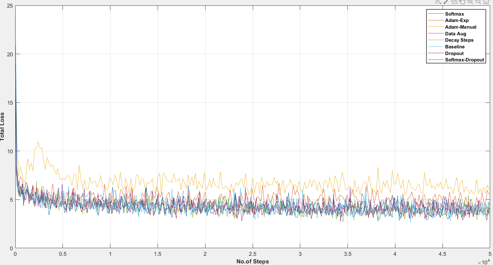
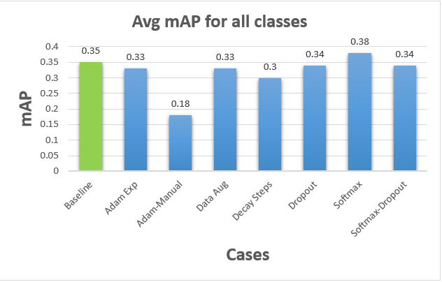
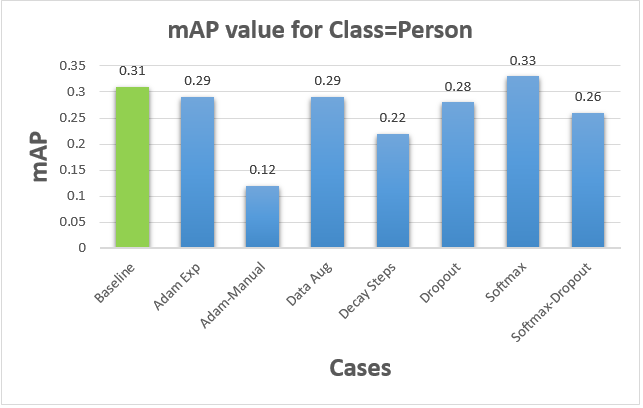
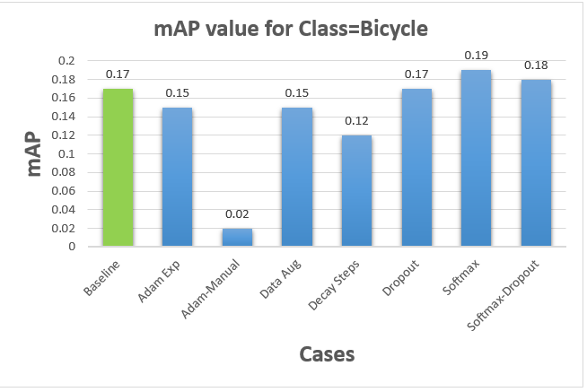
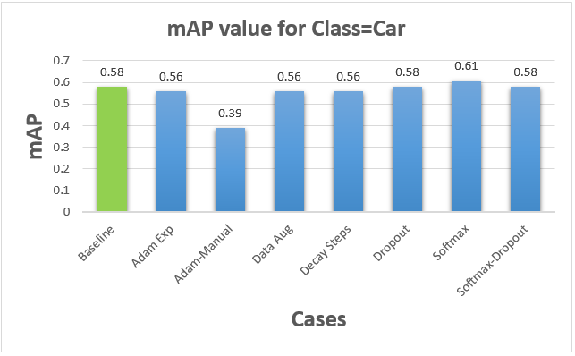

# **Results of Tweaking Hyperparameters**

Training of neural network MobileNet V2 SSD was performed on Flir dataset which contains 8862 images as the training set and 1366 images as the test set. To check the influence of hyperparameters on the model’s accuracy we have varied 1 hyperparameter at a time and evaluated the mean average precision(mAP) scores. The following hyperparameters were varied: 

| Sl.No |   Hyperparameter    |  Initial Value  | Modified Value                                               |
| ----- | :-----------------: | :-------------: | :----------------------------------------------------------- |
| 1.    | Activation function |     SIGMOID     | SOFTMAX                                                      |
| 2.    |      Optimizer      |       RMS       | 1. Adams with Manual Learning rate                                              2. Adams with exponential Learning rate |
| 3.    |  Data Augmentation  | Horizontal Flip | Black Patches                                                |
| 4.    |     Decay Steps     |    8,00,756     | 5000                                                         |
| 5.    |       DROPOUT       |       OFF       | ON                                                           |

### Reasons:

**i.** Why from **SIGMOID** to **SOFTMAX** – Sigmoid functions are generally used and preferred for 2 class logistic regression whereas SoftMax function is applicable for multi class logistic regression. This means that if a detection system is having no. of classes more than 2, we would use SoftMax function and if no. of classes < 2 then we would use Sigmoid function. SoftMax function basically works on weighted probability distribution function with respect to their class whereas Sigmoid function hardcodes/assigns either 1 or 0 to the input classes.

Let’s say, we have three classes {class-1, class-2, class-3} and scores of an item for each class is [1, 7, 2].

Sigmoid assigns the probability [0, 1, 0] whereas SoftMax assigns probability [0.1, 0.7, 0.2]. Hence, SoftMax predicts softly (with probability 0.7) that item belongs to class-2 whereas Sigmoid predicts hardly (with probability 1) that item belongs to class-2.

**ii.** Why **RMS PROP** to **ADAMS** – RMS PROP is an optimizer that searched for global minima with oscillations based on learning rate value. To minimise the frequency of oscillation we combine RMS PROP with momentum optimizer. So this is basically using to optimisers at different levels, on the other hand we have ADAM optimiser which is capable enough of handling both this function of impeding towards global minima with minima oscillation making the optimization process smoother.

Again optimization process depends upon the value at which the network is learning and taking steps. This can be done in 2 ways having a fixed learning rate (preferably small so that we take baby steps towards global minima) or exponential rate where we set a default initial learning rate for few no. of steps and then beyond that the network is dynamically adjusting its weight based on what it learns. It is preferred that the system learns dynamically and hence we have tried both the approaches to check if the literature findings are true or not.

**iii.** **Data Augmentation** – Whenever we have a limited dataset and would like to increase this dataset in order to have sufficient data for training the network we usually perform data augmentation. This is nothing but adding additional test scenarios for the network to learn and classify a class. So our idea was to add noise (gaussian) to our dataset so that our network could predict even in the worst case scenario but gaussian noise wasn’t supported in our network script so we add black patches which is loss of data which can be seen as a complimentary function to noise.

**iv.** **Decay Steps** – This function defines the no. of steps after which our learning rate should decrease. Taking the default value we observe that learning rate is fixed, and it will never change since our network is trained a maximum for 200k steps which makes this value completely useless. Since it is recommended for the network to learn dynamically we changed it to 5000 which means that after every 5000 steps the learning rate will be modified and adjusted accordingly to the networks behaviour.

**v.** **Dropout** – The basic function of dropout is to deactivate a few neurons in the network (randomly) which helps in avoiding over-fitting of the data, this helps the network in learning in a more random manner rather than following a fixed trend. This value is ‘OFF’ in the default case and we would like our network to learn in random manner and hence we tested it for ’ON’ case.

Based on the results depicted in the below graph of total loss one can conclude that **DROPOUT** and **SOFTMAX** feature improved our model accuracy by close to 3% while the other parameters yielded no significant differences in mAP value but **ADAM optimizer** with manual learning rate ended up with worst results.  

### 1.)**Total Loss**

The figure below illustrates the total loss (difference in the predicted value and the actual value) what the network train's for based on number of training steps. Depending on the obtained results, one can conclude that the training loss decreases as we increase the number of training steps. By changing different hyper-parameters (indicated by different colours in the graph) we can see the difference in the pattern of training losses.

 

### 2.) **Average mAP Values**

The figure below depicts the mean average precision value(mAP) evaluated for each hyperparameter changed individually. The results of trained neural network(MobileNet V2 SSD) with different hyper-parameters are shown in the figure, together with the baseline result, indicated in the green colour.

 

### 3.) **mAP for Person**

The figure below illustrates the mean average precision value(mAP) evaluated for each hyper-parameter changed individually. This is particularly evaluated for one of our classes which is 'person' and compared with the baseline result indicated in green colour in the figure below.

 

### 4.) **mAP for Bicycle**

The figure below depicts the mean average precision value(mAP) evaluated for each hyper-parameter changed individually. This is particularly evaluated for one of our classes which is 'Bicycle' and compared with the baseline result indicated in green colour in the figure below.

 

### 5.) **mAP for Car**

The figure below shows the mean average precision value(mAP) evaluated for each hyper-parameter changed individually. This is particularly evaluated for one of our classes which is 'car' and compared with the baseline result indicated in green colour in the figure below.

 

 
