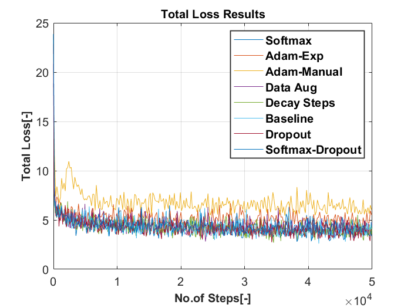

# **Results of Tweaking Hyper-Parameters**

Training is performed on Flir dataset containing 8862 images while testing is done with 1366 images. To check the influence of hyper-parameters on the model’s accuracy we have varied 1 hyper-parameter at a time and evaluated the mAP scores. The following hyper parameters were varied: 

| Sl.No |   Hyper-Parameter   |  Initial Value  | Modified Value                                               |
| ----- | :-----------------: | :-------------: | :----------------------------------------------------------- |
| 1.    | Activation function |     SIGMOID     | SOFTMAX                                                      |
| 2.    |      Optimizer      |       RMS       | 1. Adams with Manual Learning rate                                              2. Adams with exponential Learning rate |
| 3.    |  Data Augmentation  | Horizontal Flip | Black Patches                                                |
| 4.    |     Decay Steps     |    8,00,756     | 5000                                                         |
| 5.    |       DROPOUT       |       OFF       | ON                                                           |

 

Based on the below results we can infer that **DROPOUT** and **SOFTMAX** feature improved our model accuracy by close to 3% while the other parameters yielded us more or less the same mAP value but **ADAM optimizer** with manual learning rate giving us the worst results.  

### 1.)**Total Loss**

The image below shows us the Total Loss (difference in the predicted value and the actual value) what the network train's for based on number of training steps. It is quite evident that the training loss decreases as we increase the number of training steps. By changing different hyper-parameters (indicated by different colours in the graph) we can see the difference in the training losses.

 

### 2.) **Avg mAP Values**

The image below shows us the mean average precision value(mAP) evaluated for each hyper-parameter changed individually. The comparison of all hyper-parameters are made against the baseline result indicated in green colour in the image below.

 

### 3.) **mAP for Person**

The image below shows us the mean average precision value(mAP) evaluated for each hyper-parameter changed individually. This is particularly evaluated for one of our class which is 'person' here and compared against the baseline result indicated in green colour in the image below.

 

### 4.) **mAP for Bicycle**

The image below shows us the mean average precision value(mAP) evaluated for each hyper-parameter changed individually. This is particularly evaluated for one of our class which is 'Bicycle' here and compared against the baseline result indicated in green colour in the image below.

 

### 5.) **mAP for Car**

The image below shows us the mean average precision value(mAP) evaluated for each hyper-parameter changed individually. This is particularly evaluated for one of our class which is 'car' here and compared against the baseline result indicated in green colour in the image below.

 

 