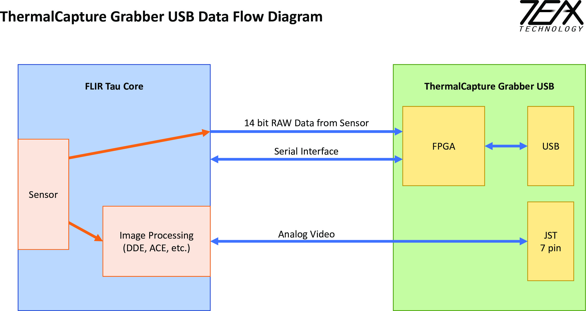
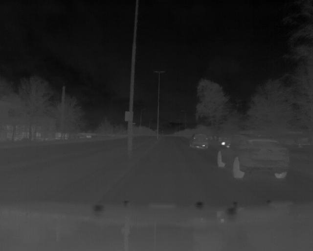
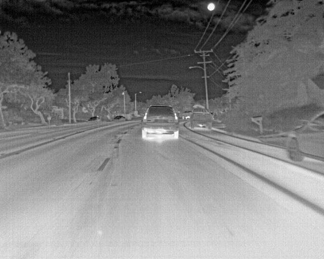
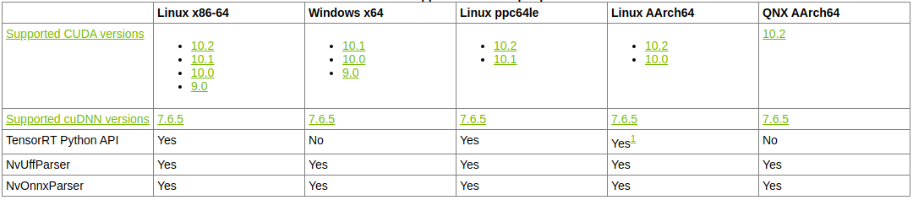

# Project Recommendations

During the development of this project, we encountered several constraints and limitations which should be addressed in the next phases of this project to improve the system's performance. This document intends to give an insight into these, and propose recommendations for future development directions.

## Hardware Constraints

- The FLIR Tau2 camera is currently attached to the *TeAx ThermalCapture Grabber*. The main functionality of the grabber is to provide an easy interface to transmit image data via USB to the target hardware (PC or Jetson Xavier). Nevertheless, as Figure 1 shows, the thermal grabber's serial interface interacts directly with the Tau2 sensor, streaming 14-bit RAW data only. 

  

  
 

  *Figure 1: data flow diagram of the FLIR Tau 2 camera connected to the thermal grabber*

  

  This means that data fetched via the grabber will not be affected by the image processing settings of the Tau2. Because of this, Automatic Gain Control (AGC), along with other image-enhancing filter functionalities (DDE, ACE) will not be available. This means that the quality of data obtained with this setup will significantly differ from the data used for training (FLIR's dataset), degrading inference performance. The quality difference is shown in Figure 2. 

  
   

  *Figure 2: Low resolution (left) image acquired using the TeAx thermal grabber compared to a high resolution (right) image from FLIR's dataset.*

  

  **Recommendation :** FLIR support recommends a couple of products that could be looked into to solve this problem, namely, [Workswell's USB3 module](https://www.drone-thermal-camera.com/usb3-gige-modules-for-flir-tau/) and the [Camera Link board](https://www.flir.com/products/421-0046-00_camera-link-expansion-board/). However, more analysis is required to acquire the right board in terms of functionality and price. 

  

- The system is designed to support visibility during the night, as well as harsh weather conditions. Nevertheless, due to timing constraints, the current camera mounting is not waterproof, which limits the testability of the system in rainy weather. 

  

  **Recommendation:** The current camera mounting design should be used as a baseline to develop a water-proof mounting. 

## Software Constraints 

- The [NVIDIA's Jetson Xavier AGX](https://developer.nvidia.com/embedded/jetson-agx-xavier-developer-kit) is currently using [Jetpack 4.3](https://developer.nvidia.com/embedded/jetpack), which includes the [L4T](https://developer.nvidia.com/embedded/jetson-agx-xavier-developer-kit) driver package (based on Ubuntu 18.04), providing the Linux kernel, bootloader, and the NVIDIA drivers for the Jetson platform. Furthermore, Jetpack 4.3 ships with the following libraries already installed:

  

  1. CUDA Toolkit 10.0.326
  2. TensorRT 6.0.1
  3. cuDNN 7.6.3

  

  This presents possible compatibility problems if the current system was to be integrated on the vehicle's PC. This is mainly due to the PC running  different OS and driver versions (**Ubuntu 16.04** and **CUDA 9**). 

  

  **Recommendation:** There is a high dependency between the version in which the models are trained, and the version of TensorRT used for optimization. Therefore, in case the system wants to be integrated on the PC, the recommendation is to stick with **TensorRT 6.0** (or higher), and **cuDNN 7.6.3** to ensure the optimization can be executed successfully. Furthermore, Tensorflow-gpu 1.12 is the recommended version to ensure the ssd_mobilenet_v2 model is optimized successfully. 

  

  As an additional note, by looking at NVIDIA's support information, TensorRT 6.0.1 should be compatible with **CUDA 9** (on the x86 architecture). However, this should be tested thoroughly, as compatibility problems are likely to arise.

  
 

  *Figure 3: NVIDIA's Documentation on TensorRT 6.0.1 Support.*

  

- The inference code was developed in Python. However, this imposes a performance penalty in terms of execution speed. 

  

  **Recommendation:** To ensure the best performance, future development should look into migrating the online inference to a purely  C++ based implementation.

  

- If a different architecture would like to be used instead of *SSD-MobileNet*, significant changes to the workflow presented in this repository would be necessary. According to [NVIDIA](https://forums.developer.nvidia.com/t/convert-faster-rcnn-tensorflow-model-to-tensorrt-plan/77578), higher complexity architectures, such as *FasterRCNN*, require several modifications (via [TensorRT plugins](https://docs.nvidia.com/deeplearning/sdk/tensorrt-api/python_api/parsers/Uff/Plugins.html)) before they can be parsed and optimized. Furthermore, a good knowledge of the underlying architecture is necessary to perform the right modifications (via [Graph Surgeon](https://docs.nvidia.com/deeplearning/sdk/tensorrt-api/python_api/graphsurgeon/graphsurgeon.html)). 

  

  **Recommendation:** Due to the aforementioned reasons, NVIDIA suggests users migrate their workflow to [NVIDIA's Transfer Learning Toolkit](https://developer.nvidia.com/transfer-learning-toolkit), where these models are supported for training and optimization, removing TensorFlow from the equation. However, a significant consideration that should be taken into account is the limited user support and documentation of this tool in comparison to more widespread platforms like TensorFlow.

## Dataset Constraints 

- While gathering additional data to improve the network's performance, we noticed the quality difference between the recorded data and FLIR's ADAS dataset. Because of this (and the lack of hardware), it was not possible to include our data to expand the dataset.

  

  **Recommendation:** New data should have the same quality as FLIR's ADAS dataset to guarantee the network performance does not degrade. This is important for online detection, as inference should be performed on images with the same quality as the training set data. As an additional recommendation, data recording should be at a low framerate (low frequency) to save captures which are somewhat different, thus contributing more to the training. Otherwise, capturing at high frequency leads to redundant data that has to be cleaned, making the cleaning and labeling process cumbersome.

- FLIR provides a dataset with approximately 14,000 images for training. Nevertheless, to achieve a high precision and recall (~98%) significantly more images would be required. 

  

  **Recommendation:** More data needs to be acquired to improve the performance of the system. Furthermore, this data should be taken on different weather conditions due to the inherent temperature differences between settings. Moreover, specific calibration of the camera should be look into to ensure the best performance.

  

- FLIR's ADAS dataset mostly supports car, person and bicycle detection. Our recorded low-quality dataset includes buses and trucks as Cars due to the low amount of bus/trucks examples (~5). However, It is recommended to include buses and trucks in the classification as an additional class, since they have different driving behaviors (speed and acceleration) as well as a different size. 

  

  **Recommendation:** These new classes should be included in the dataset.

  

- With the current image quality (due to the Thermal Grabber), and the Dutch weather, it is hard to distinguish Bicycles from the background, as these do not emit heat. Because of this, cyclists are classified as persons. 

  

  **Recommendation:** Once the image quality issue is fixed, it should be ensured that bicycles are visible in the Dutch weather, where the sun does not heat the metal compared to sunny places (like California).

  

- Due to the limited time-frame of the project, as well as the hardware and health situation, no data was gathered for Mopeds, motorbikes and animals. Therefore, these are not detected by the system.

  

  **Recommendation:** These classes should be included in the dataset to ensure a more robust and safe system operation.

  

