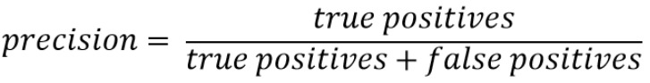
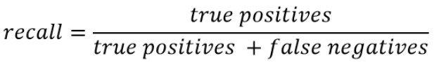

# Mean Average Precision(mAP)

## References 

[Measuring Object Detection models](https://tarangshah.com/blog/2018-01-27/what-is-map-understanding-the-statistic-of-choice-for-comparing-object-detection-models/ )

[Understanding mean Average Precision for Object Detection](https://medium.com/analytics-vidhya/map-mean-average-precision-for-object-detection-with-simple-python-demonstration-dcc7b3850a07)

[mAP (mean Average Precision) for Object Detection](https://medium.com/@jonathan_hui/map-mean-average-precision-for-object-detection-45c121a31173 )

[Guide to Performance Metrics](https://manalelaidouni.github.io/manalelaidouni.github.io/Evaluating-Object-Detection-Models-Guide-to-Performance-Metrics.html )

## Introduction

The performance of the object detectors are being assessed by specific metrics to show how well the system performs. The opportunity to compare different multi object detection system performances has been enabled by these metrics. Currently, these predefined metrics are provided by PASCAL VOC and MS COCO to describe how different detectors perform on their datasets.

There are different kinds of metrics that are being used for the performance evaluation such as Average Precision, Recall, mean average precision(mAP), Precision Vs Recall Curve. It is often confusing to choose between these metrics. For this project, mAP has been chosen as evaluation metric which is recommended and used by the TensorFlow Object Detection API.

### What is Precision?

Precision is the ratio of number of true positives divided by number of true positives plus number of false positives where true positive are cases where the model correctly identifies the object and labels it's associated class whereas false positive are cases when the model incorrectly labels it as right class whereas in actual it is not the right class.

### What is Recall?

Recall is the ratio of number of true positives divided by number of true positives plus number of false negatives where false negatives are cases where the object should have been labelled as a positive class but wasn't labelled(missed detection). 

### Why mAP?

Object Detection algorithm has to do two tasks both classification and localisation of multiple classes and objects in a single image. And these tasks should be evaluated. For this purpose, mAP is used instead of precision metric because the latter is only used in image classification problems and cannot be directly employed in the problems mentioned initially.

Along side mAP, IoU(Intersection over union) is also employed as a metric to evaluate the performance of the object detection system. This metrics are described briefly in the following sections.

## IoU & mAP

IoU means Intersection over Union. It is also referred as Jaccard Index. This is measured using the ground truth bounding boxes and predicted bounding boxes. Measurement is specifically upon the overlap of these bounding boxes. We use this to verify how much our predicted boundary overlaps with the ground truth. In reality, a predefined IoU threshold is set to classify whether the prediction is a true positive or a false positive. Figure 1 depicts an example of calculating IoU on a particular object. 

Currently, an IoU threshold of 0.5 is used by PASCAL VOC challenge, while MS COCO averages mAP over various IoU thresholds with a step of 0.05 from 0.5 to 0.95.

*Figure 1: IoU calculation of the following example*

**mAP**- If the IOU >= 0.5(this threshold is decided by the user) for the classes we are evaluating then each of that image bounding box data is classified to that class and stored. This is done for all the classes, we then divide the obtained no. of predicted classes based on IOU with actual no. of bounding box labels present in the annotation file, this is called average precision per class. Once the average precision is obtained for each class we then add all these values together and divide by total no. of classes which gives us mean average precision (mAP).

### Optional

You could also use both the methods of mAP and Precision/Recall to test your network as this gives you a deeper understanding of your network's capabilities. Like mAP, value helps you evaluate your network's performance per class which is beneficial to understand if you need to collect more data to improve the mAP scores or not whereas Precision/Recall helps you evaluate the smallest range up to which your network can perform effectively as even the network is having limitations after reaching a certain bounding box area.

 

