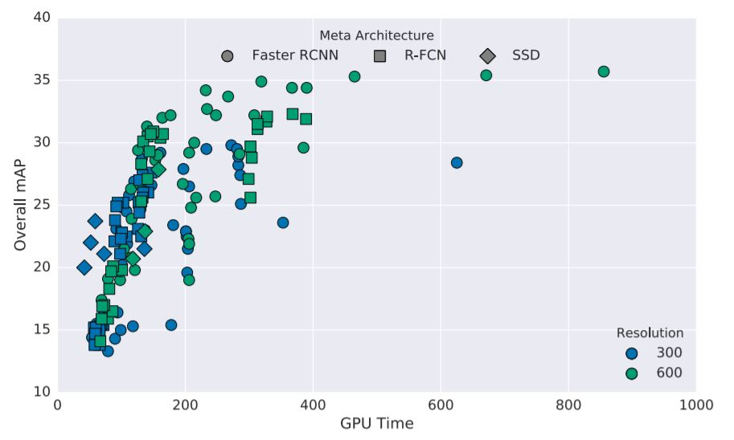

# TRAINING ON OTHER ARCHITECTURES

## List of Abbreviations

**COCO** - Common Objects in Context

**RCNN** - Region based Convolutional Neural Network

**SSD** - Single Shot Detector

## References

- [Speed/accuracy trade-offs for modern convolutional object detectors]: https://arxiv.org/pdf/1611.10012.pdf

  

## Introduction

TensorFlow offers various architectures for object detection system, based on the requirements of speed and accuracy of the model a choice had to be made. MobileNet v2 is the most preferred model due to its real time processing speed but lacks in terms of accuracy. On the other hand Faster RCNN ResNet 50 and Inception V2 model had the highest accuracy for object detection despite of their low speed to detect objects compared to MobileNet in terms of speed. 

Table 1 illustrates all these three networks speed and their respective COCO mAP score. The below data is obtained from https://github.com/tensorflow/models/blob/master/research/object_detection/g3doc/detection_model_zoo.md which is based on Google’s results.

| Neural Network Architecture | Speed(ms) | COCO mAP |
| --------------------------- | --------- | -------- |
| MobileNet V2 SSD            | 31        | 22       |
| Faster RCNN ResNet-50       | 89        | 30       |
| Faster RCNN Inception V2    | 58        | 28       |

*Table 1: Different neural network architectures with their speed and COCO mAP*

**Faster RCNN**

In Faster RCNN, the detection happens in 2 stages with the first stage referred as regional proposal network (RPN), images are processed by a feature extractor (e.g. ResNet-50), and features at some selected intermediate level (e.g. “conv5”) are used to predict class box proposals. In the second stage the box proposals are used to crop features from the same feature map and then this features are fed into remainder feature extractor in order to predict a class for the feature. 

Since this a two-step process, it generally takes more computation time compared to other networks. But if look at the 2 main factors (discussed below) affecting it’s speed we can use this network efficiently.

The 2 main factors are: - 

- **Effect of image and object size**

  It has been observed from research that input image size or image resizing has a significant effect on the accuracy of the network and based on available data we observe that decreasing the resolution by a factor 2 in both dimensions results in lower accuracy by 15.88% on an average. Also, smaller resolution images tend to detect larger objects easily but fail to detect smaller objects. This can be observed in the SSD mobile net network which resizes the images for its input layer and thus we have a poor accuracy. The figure below clearly indicates the performance of network based on image size.

*Figure 1: Overall mAP vs GPU Time of different object detectors based on image size*	

Thus based on the above figure we can say that higher resolution images have significantly better mAP 	value compared to smaller ones (usually twice the value). We can also observe that even smaller objects 	mAP value are quite good compared to SSD Mobile net. This helps us choosing Faster RCNN over Mobile 	net in terms of accuracy of the network.

- **GPU Time**

  Due to smaller input image Mobile net network gets the benefit of speed in terms of real-time processing of images whereas Faster RCNN on the other hand are comparatively slower. The figure below gives us a good estimate in terms of GPU time.

*Figure 2: Overall mAP vs GPU Time of different object detecting architecture*s

**Faster RCNN – ResNet-50 & Inception V2** 

Based on above observations, Faster RCNN ResNet-50 can be put in the scope of project because of its no. of proposals (Region of interest) i.e., no. of bounding boxes or classes in an image to search for, if we can limit out proposal to 50 from 300 we can reduce the running GPU time by a factor of 3 (as per Study from Google). This means that FRCNN would be equally good with respect MobileNet in terms of Speed. Overall we could achieve good speed and accuracy with Faster RCNN.

Thus seeing the performance of Faster RCNN ResNet-50 we decided to conduct test on this network. 

Now to make the most of speed and accuracy trade off, Faster RCNN inception v2 model was the right fit as it gave better accuracy compared to both the networks and comparatively better speed w.r.t Faster RCNN ResNet-50 model. This speed could be further optimized to match Mobilenet v2 speed which is discussed in the results section(below).

## **Results & Discussion**

*Figure 3: Performance comparison between three neural network architectures* 

From figure 3, we can clearly see that Faster RCNN ResNet-50 outperforms Mobilenet v2 in all aspects with an improvement of 26% for bicycle class, 22% for Car class and 34% for Person class. Overall we observe that total improvement is about 27% compared to Mobilenet v2. On other hand, Faster RCNN Inception v2 model also has slightly better performance over Mobilenet v2. The bicycle class having the most improvement by 8% whereas class car showing an improvement by 5%. The overall improvement in accuracy for FRCNN is 2% compared to Mobilenet v2.

Thus, one can summarize that

- Faster R-CNN with ResNet-50 can attain better performance over MobileNet V2 SSD in terms of accuracy(mAP) if we restrict the number of proposals to 50 with cost of speed. 
- Faster RCNN Inception v2 also performs better than Mobilenet in terms of accuracy(mAP) for detecting classes(Bicycle, Car) whereas there is a decrement in performance w.r.t class person but this could be improved upon by adding few more training images consisting of person annotations.
- The speed of Faster RCNN inception v2 is close to 1.8 times slower than Mobilenet v2 but this can be improved by reducing the region of interest proposals to 20 per image which would give us competitive speed w.r.t. MobileNet v2 model without any compromise in accuracy.