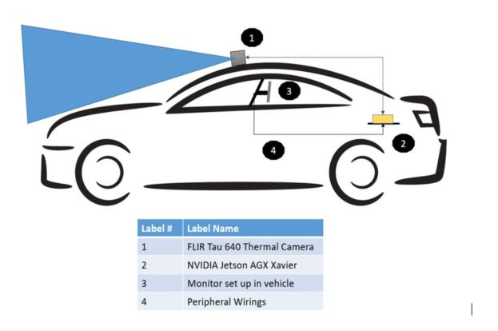

# Thermal Object Detector Beta Test Plan

# List of Abbreviations

VOC = Visual Object Classes 

COCO = Common Objects in Context

SSD = Single Shot Detector

mAP = Mean Average Precision

IoU = Intersection over Union

# Post Process Analysis

The link below directs you to the documentation done on the analysis after the test. 

[Beta Test Post Analysis](beta_test_post_analysis.md)

This describes how well the team tried to cover all the planned test procedure prior to the test which were mentioned in detail below. 

# 1 Objective

The objective of the Beta Test is to test and verify the functionality of  neural network pipeline for object detection using thermal camera in real time environment using NVIDIA Jetson and to ensure the proper mounting of the hardware on the car.

## 1.1 Introduction

### 1.1.1  Beta Testing

Testing of a system is generally a standard procedure followed in every project. This is done to ensure that the all the subsystems working together in a proper way and to identify the anomalies in the system. Additionally, testing procedure makes sure that a system is robust or not and reveals new issues that have not been encountered during the development phase of a system.

In this project, a beta test has been set as first milestone to check the integration and performance of the thermal object detection system that has been developed. The test results will help to focus on specific points that helps to enhance the system performance as well as to identify the outliers that are affecting the system functionality.

## 1.2 Hardware Setup

This NVIDIA Jetson Xavier is connected to thermal camera as shown below. It is mounted on the roof of the car. Thermal camera is further connected to The NVIDIA Jetson Xavier which is mounted in back of car (trunk) via mini B to USB wire. The Jetson is further connected to the monitor placed in second row of car to run the test as well as to observe the inference.

Following is the setup of the system deployed in the vehicle:

# 2 Testing Setup

This section will give insights of the compliances need to be fulfilled to carry out the test for safety as well as seamless operation of test. Following are the compliances for the test: 

- **<u>Rules before starting the test. (Checklist)</u>**

   - ​	Camera mounting should bolted to roof properly.

   - ​	Camera should be mounted to camera holder by 4 screws properly.

   - ​	Jetson should be mounted properly to the base plate in trunk of the car.

   - ​	Wiring peripherals should be connected to devices properly.

   - ​	The script required to initiate the test via NVIDIA Jetson.

   - ​	Tyre Pressure check.

   - ​	Note the odometer reading before the test.

- **<u>No of people for the assistance in the car other than driver</u>**

   - Driver : Tijs (or AIIM personnel) 

   - Front Seat : Koen

   - Back Seat I : Hiram (for monitoring the inference on monitor/Laptop)

   - Back Seat II : *Any one can volunteer.*

- **<u>Trajectory and corresponding driving scenario</u>**

   Point to point trajectory (road path) will be decided by Koen and Tijs. The trajectory should cover both following urban and rural scenarios.

   - Urban Scenario I : Simulating Highway road @ 70-80 Kmph

   - Urban Scenario II : Simulating City road @ 40-50 Kmph

   - Rural Scenario : Simulating Rural road @ 20-30 Kmph

- **<u>Configuration of the Camera</u>**

   The camera configuration is controlled by the FLIR provided Camera Controller GUI software. It needs to be made sure that thermal camera configuration is in factory default settings (Setup<FFC<Auto<7200 Frames.)

- **<u>Time and duration of the test</u>**

   Date : 6/3/2020

   Time : 10:30 to 12:00 (1hour 30mins)

   Backup day : If there is rain during that time, new test time will be set as per Tijs. 

- <u>**Environmental Conditions**</u>

   There should be no moderate or heavy rain during any point of test. If there will be any, test will be halted.

# 3 Constraints 

This section describes in detail the constraints to the tests scenario. The preliminary constraints are as follows: 

- <u>**Weather Conditions**</u>: This test is constrained to be performed only in absence of moderate or heavy rainfall.

- <u>**Thermal camera**:</u> The thermal camera is recording the video based on the specific configuration given by Camera Controller GUI factory default set.

 

# 4 Procedure

## 4.1 Pre-testing Procedure

This section contains all the key information about the procedure that should be followed before starting the test and during the test. 

The installation of the whole system and its verification should be done 30 mins before the test starts. The time can be varied depending on the availability of the car and stakeholder.

Installation of the system includes the mounting of the thermal camera on the 3D printed mounting system which was fixed to the car roof using fasteners. In addition, it includes the mounting of the Jetson Xavier at the rear end of the car in the trunk and its connection with both the camera and laptop through wiring interface should be ensured. 

Once after this process, the whole software integration of the system should be tested using the laptop to check the correct functioning of the system. 

Kindly run the camera on Jetson for 1 hour to check the operating limit of it. This is necessary to prevent the camera operation failure during the test.

## 4.2 Post-testing Procedure

Once after the test is done, the data should be collected and stored in the local PC for the offline analysis of the inference that the trained neural network generated while testing. 

The laptop can be disconnected from the Jetson Xavier. The data obtained from the test will help to calculate the [mAP](#List-of-Abbreviations) score based on the [IoU](#List-of-Abbreviations) of the predicted bounding boxes of the trained neural network. 

Thermal Camera and Jetson Xavier can be unscrewed and detached from the mounting. Jetson Xavier is used to optimise the frozen inference graphs offline obtained after training the neural network. 

The link provided above in the section Post process analysis will give you more insights above test went on the day.

 

 

 

 

 
