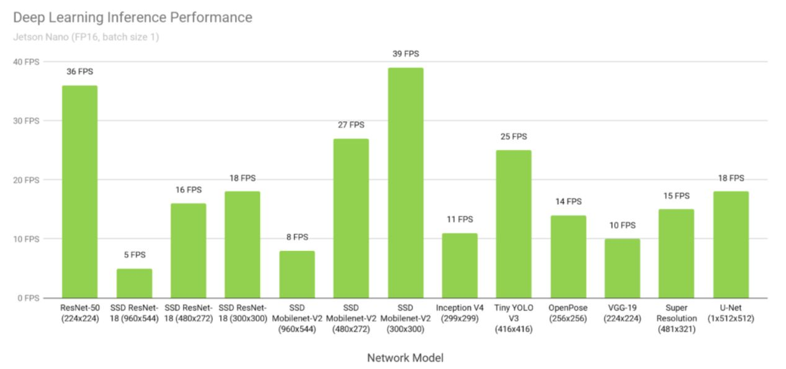
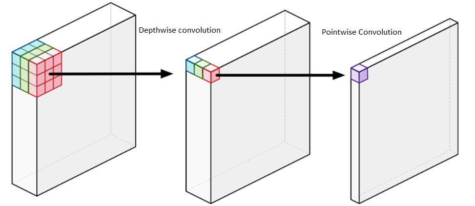
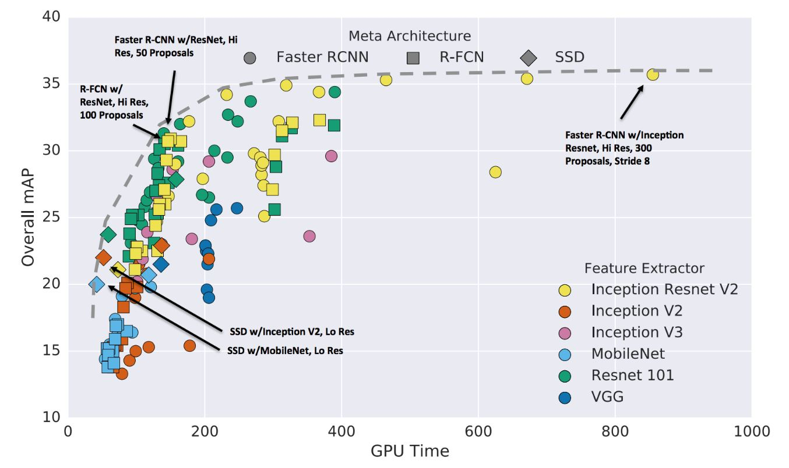
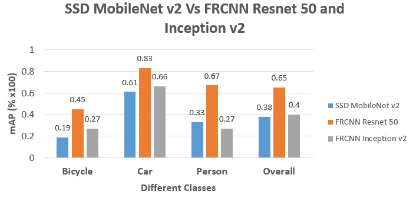

# Object Detection Architectures Benchmarks

## List of Abbreviations

**COCO** - Common Objects in Context

**RCNN** - Region based Convolutional Neural Network

**SSD** - Single Shot Detector

## Introduction

Selecting an appropriate neural network architecture is an important task. This is because of the neural network architecture being the main part of the whole object detection system. As per the stakeholder requirements, the performance of the system is biased towards both speed and accuracy. On contrary, there are certain limitations on the system such as computational power of the hardware to achieve those requirements. Having this in mind, specific network architecture must be selected that fulfils all these requirements with reasonable trade off.   

TensorFlow provides various pretrained neural network architectures for object detection system. As a first step, [SSD](#List-of-abbreviations) MobileNet v2 300x300 neural network has been selected based on benchmarks released by Nvidia as shown in figure 1.

*Figure 1: Various deep learning inference networks performance on Jetson Nano and TensorRT* [Ref](https://developer.nvidia.com/embedded/jetson-nano-dl-inference-benchmarks) 

The [SSD](#List-of-abbreviations) MobileNet v2 model, which has a [SSD](#List-of-Abbreviations) as its object detector and MobileNet v2 as its feature extractor, is the most preferred model because of its real time processing speed. The pitfall of the model is that it has an accuracy level which is not matching the requirements. In the later stage of the project, the Faster [RCNN](#List-of-abbreviations) neural network has been taken in to consideration due to its accuracy for object detection despite of its low speed to detect objects compared to MobileNet as per the Google's result. Faster [RCNN](#List-of-abbreviations) is an object detector and both ResNet-50 and Inception v2 are feature extractors. 

Table 1 illustrates all these three networks speed and their respective [COCO](#List-of-abbreviations) mAP score. The below data is obtained from [source](https://github.com/tensorflow/models/blob/master/research/object_detection/g3doc/detection_model_zoo.md) which is based on Google’s results.

| Neural Network Architecture | Speed(ms) | COCO mAP |
| --------------------------- | --------- | -------- |
| SSD MobileNet V2            | 31        | 22       |
| Faster RCNN ResNet-50       | 89        | 30       |
| Faster RCNN Inception V2    | 58        | 28       |

*Table 1: Different neural network architectures with their speed and COCO mAP*

**SSD MobileNet V2**

MobileNet architecture was developed for mobile and embedded vision applications. The architecture was built such that it efficiently trades off between latency and accuracy. [SSD](#List-of-Abbreviations) MobileNet v2 uses depthwise separable convolutions. The main idea of using depthwise separable convolution is to build light weight deep neural networks which can work faster than usual neural network architectures. Depthwise separable convolution is a combination of depthwise convolution followed by a pointwise convolution. Unlike a regular convolution, Depthwise performs convolution on each channel separately instead of combining all the 3 channels. For an image with 3 channels, a depthwise convolution creates an output image that also has 3 channels. Each channel gets its own set of weights. The pointwise convolution will add up these 3 channels same as normal convolution with kernel size 1x1. Figure 2 depicts this process.

Figure 2: Depthwise separable convolution [source3](https://machinethink.net/blog/googles-mobile-net-architecture-on-iphone/)

Even though this procedure is same as the regular convolution, it is much faster than regular convolution because regular convolution has to do much more computational work and needs to learn more weights to filter the data and make new features.

The benefit in speed for [SSD](#List-of-Abbreviations) MobileNet v2 comes at the cost of accuracy. Since there is resizing of images to a smaller dimension, the network does not detect smaller dimension objects in an image accurately. On the other hand higher dimension object detection performance is quite satisfactory. This way there is a trade-off for [SSD](#List-of-Abbreviations) MobileNet v2 in terms of accuracy for varied dimensions of objects in images.

This article has been taken from the [source1](https://machinethink.net/blog/mobilenet-v2/), [source2](https://arxiv.org/pdf/1801.04381.pdf), [source3](https://machinethink.net/blog/googles-mobile-net-architecture-on-iphone/)and [source4](https://arxiv.org/pdf/1704.04861v1.pdf) and modified.

**Faster RCNN**

In Faster [RCNN](#List-of-abbreviations), the detection happens in two stages with the first stage referred as regional proposal network (RPN). The images are processed by a feature extractor (e.g. ResNet-50), and features at some selected intermediate level (e.g. “conv5”) are used to predict class box proposals. In the second stage the box proposals are used to crop features from the same feature. Upon these features are fed into remainder feature extractor in order to predict a class for the feature. 

Since this is a two-step process, it generally takes more computation time compared to other networks. The increased computation time is due to the effect of different object size, image input size, epoch size, number of region of interests etc. Based on all the highlighted factors, the 2 main factors which affect the network speed significantly will be discussed later. Also, reduction in the size of these 2 factors can cope up with the network performance in terms of speed.

The 2 main factors are: -  

- **Effect of image and object size**

  Research performance in link [Speed/accuracy trade-offs for modern convolutional object detectors](https://arxiv.org/pdf/1611.10012.pdf) explains that input image size or image resizing has a significant effect on the accuracy of the network and based on available data we observe that decreasing the resolution by a factor 2 in both dimensions results in lower accuracy by 15.88% on an average. Also, smaller resolution images tend to detect larger objects easily but fail to detect smaller objects. This can be observed in the [SSD](#List-of-abbreviations) MobileNet v2 network which resizes the images for its input layer and thus we have a poor accuracy. The figure 3 clearly indicates the performance of network based on image size.

*Figure 3: Overall mAP vs GPU Time of different object detectors based on image size* [source5](https://arxiv.org/pdf/1611.10012.pdf)

Thus based on figure 1 we can say that higher resolution images have significantly better mAP value compared to smaller ones (usually twice the value). Also, the mAP value for smaller objects is higher compared with the [SSD](#List-of-abbreviations) MobileNet v2 network. Thus, our preference is using Faster [RCNN](#List-of-abbreviations) because of its higher accuracy

- **GPU Time**

  The input image for [SSD](#List-of-abbreviations) MobileNet v2 network is always resized to a smaller dimension which  gives the network the benefit of speed in terms of real-time processing of images whereas Faster [RCNN](#List-of-abbreviations) on the other hand have higher dimension input images which reduces its speed performance compared to [SSD](#List-of-abbreviations) MobileNet v2. The figure 3 below gives us a good estimate in terms of GPU time.

*Figure 4: Overall mAP vs GPU Time of different object detecting architecture*s [source5](https://arxiv.org/pdf/1611.10012.pdf)

**Faster RCNN – ResNet-50 & Inception V2** 

Based on figure 4, Faster [RCNN](#List-of-abbreviations) ResNet-50 becomes a potential candidate of the system due of its number of region of interest in an image to search for. If we can limit out proposal to 50 from 300 we can reduce the running GPU time by a factor of 3 (as per study from Google). This means that Faster [RCNN](#List-of-abbreviations) would be equally good with respect [SSD](#List-of-abbreviations) MobileNet v2 in terms of Speed. Overall, satisfying speed and accuracy could be reached with Faster [RCNN](#List-of-abbreviations).

Thus seeing the performance of Faster [RCNN](#List-of-abbreviations) ResNet-50 we decided to conduct an accuracy test on this network for our dataset. 

After making a speed-accuracy trade off, Faster [RCNN](#List-of-abbreviations) inception v2 model was the right fit as it gave better accuracy compared to both the networks and comparatively better speed with respect to Faster [RCNN](#List-of-abbreviations) ResNet-50 model. This speed could be further optimized to match [SSD](#List-of-abbreviations) MobileNet v2 speed which will be discussed in the results section.

**Results & Discussion**

*Figure 5: Performance comparison between three neural network architectures* 

Figure 5 is the bar diagram depicting the performances of neural network in terms of mAP score per class which were obtained after training them on Flir dataset.

From figure 5, we can clearly see that Faster [RCNN](#List-of-abbreviations) ResNet-50 outperforms [SSD](#List-of-abbreviations) MobileNet v2 in all aspects with an improvement of 26% for bicycle class, 22% for car class and 34% for person class. Overall we observe that total improvement is about 27% compared to [SSD](#List-of-abbreviations) MobileNet v2. On other hand, Faster [RCNN](#List-of-abbreviations) Inception v2 model also has slightly better performance over [SSD](#List-of-abbreviations) MobileNet v2. The bicycle class has the most improvement by 8% whereas to the class car shows an improvement of 5%. The overall improvement in accuracy for Faster [RCNN](#List-of-abbreviations) Inception v2 is 2% compared to [SSD](#List-of-abbreviations) MobileNet v2.

## Conclusion

Thus, one can summarize that

- Faster [RCNN](#List-of-abbreviations) with ResNet-50 can attain better performance over [SSD](#List-of-abbreviations) MobileNet v2 in terms of mAP if we restrict the number of proposals to 50 with cost of speed. 
- Faster [RCNN](#List-of-abbreviations) Inception v2 also performs better than [SSD](#List-of-abbreviations) MobileNet v2 in terms of mAP for detecting classes(bicycle, car) whereas there is a decrement in performance with respect to class person. This can be improved upon by adding few more training images consisting of person annotations.
- The reported speed of Faster [RCNN](#List-of-abbreviations) inception v2 is close to 1.8 times slower than [SSD](#List-of-abbreviations) MobileNet v2 but this can be improved by reducing the region of interest proposals to 20 per image which would give us competitive speed with respect to [SSD](#List-of-abbreviations) MobileNet v2 model without any compromise in accuracy.

This project also provided a bit of scope to do research on neural network performances by tweaking and testing hyperparameters. This research work concludes that

- The performance of the neural network architecture in terms of speed can be increased by reducing the number of detections per class in a given image.
- Trained images should be consistent in image quality and large variance in this aspect will result in the performance in terms of detection and accuracy of the neural network architecture.

