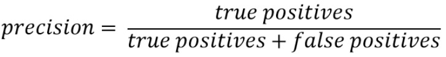
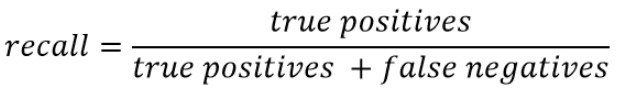
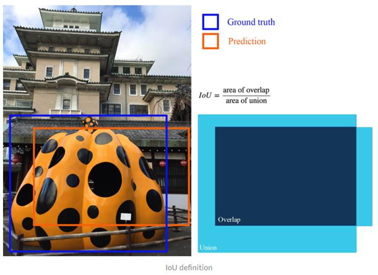

# Evaluation Metric

## Introduction

In order to asses the performance of different object detection architectures, specific metrics are chosen to demonstrate the system performance. Based on the standardized PASCAL VOC and MS COCO format, there are metrics which will be used for evaluating the object detection model's performance. 

These metrics are average precision, recall, mean average precision(mAP), precision Vs recall curve, where, mAP is the mean of the per class average precision. Based on the different metric choices, mAP has been chosen as evaluation metric for this project which is recommended and used by the TensorFlow Object Detection API.

Pascal VOC  and MS COCO are the standard formats for neural network architecture of object detection systems. They have their own metrics which are being used by the TensorFlow object detection API. The objective of these challenges is to provide a common framework for evaluating and comparing multiple class object detection architectures. Both use different types of input files to convert TFRecords files. For example, PASCAL VOC is using the annotation file in an XML file which contains the details of the classes and ground truth values of their bounding boxes per picture in the dataset. On the other hand, MS COCO is using JSON file which is a different XML format and includes all the details of entire dataset in single format.

Further detailed information about this formats can be found in [TensorFlow Training](thermal_object_detection/tensorflow_training/README.md).

### What is Precision?

Precision is the ratio of number of true positives divided by number of true positives plus number of false positives where true positive are cases where the model correctly identifies the object and labels its associated class whereas false positive are cases when the model incorrectly labels it as right class whereas in actual it is not the right class.

### What is Recall?

Recall is the ratio of number of true positives divided by number of true positives plus number of false negatives where false negatives are cases where the object should have been labelled as a positive class but isn't labelled(missed detection). 

### Why mAP?

The object detection algorithm does two tasks, namely classification and localization of multiple classes and objects in a single image. These tasks are evaluated. For this purpose, mAP is used instead of precision metric because the latter is only used in image classification problems and cannot be directly employed in the problems mentioned initially. The reason being, for example, a particular image consists of multiple classes in it, if we use precision metrics it will detect all the objects in an image and divide it by the total number of objects present in that image. Now these total number of images are a combination of different classes and so the obtained precision is with respect to the image and not with respect to the class. In other words, we require precision per class and not per image as it has no significance for conducting our evaluation.

Alongside mAP, IoU(Intersection over Union) is also employed as a metric to evaluate the performance of the object detection system. These metrics are described briefly in the following sections.

## IoU & mAP

IoU, also referred as Jaccard Index, is measured using the ground truth bounding boxes and predicted bounding boxes. Measurement is specifically upon the overlap of these bounding boxes. We use this to verify how much our predicted boundary overlaps with the ground truth. In reality, a predefined IoU threshold is set to classify whether the prediction is a true positive or a false positive. Figure 1 depicts an example of calculating IoU on a particular object. 

Currently, an IoU threshold of 0.5 is used by PASCAL VOC challenge, while MS COCO averages mAP over various IoU thresholds with a step of 0.05 from 0.5 to 0.95.

*Figure 1: IoU calculation example*

**mAP**- If the IoU(this threshold is decided by the user) for the classes that are being evaluated is more than 0.5, then bounding box data is classified to that class and stored for that image. This is done for all the classes. Then the obtained number of predicted classes based on IoU is divided with the actual number of bounding box labels present in the annotation file. This is called average precision per class.

### Optional

You could also use both the methods of mAP and precision/recall to test your network as this gives you a deeper understanding of your network's capabilities. Like mAP score helps you to evaluate and assess your network's performance per class. This is beneficial to understand that whether there is need to collect more data to improve the mAP scores or not. On the other hand, precision/recall helps in evaluating the smallest range up to which the network can perform effectively even in case of  limitations after reaching a certain bounding box area.

The mAP method has fewer parameters to formulate in terms of logic of operation whereas the COCO evaluation method of precision/recall has too many parameters to deal with like what size of bounding boxes you start with and end with, number of simulations. This method must be done with various recording data to actually prove that these bounding boxes numbers are viable which increases complexity of the project.  

For more information of the mAP and other metrics, go through the links mentioned as follows: 

- [Measuring Object Detection models](https://tarangshah.com/blog/2018-01-27/what-is-map-understanding-the-statistic-of-choice-for-comparing-object-detection-models/ )
- [Understanding mean Average Precision for Object Detection](https://medium.com/analytics-vidhya/map-mean-average-precision-for-object-detection-with-simple-python-demonstration-dcc7b3850a07)

- [mAP (mean Average Precision) for Object Detection](https://medium.com/@jonathan_hui/map-mean-average-precision-for-object-detection-45c121a31173 )

- [Guide to Performance Metrics](https://manalelaidouni.github.io/manalelaidouni.github.io/Evaluating-Object-Detection-Models-Guide-to-Performance-Metrics.html )

 

