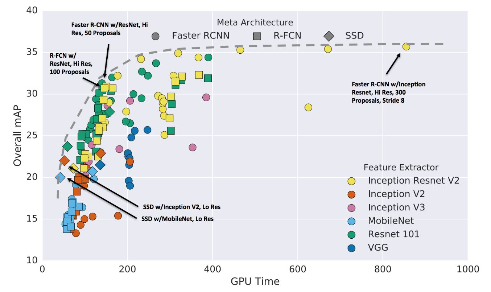

# Object Detection Architectures Benchmarks

## List of Abbreviations

**COCO** - Common Objects in Context

**RCNN** - Region based Convolutional Neural Network

**SSD** - Single Shot Detector

## Introduction

TensorFlow offers various architectures for object detection system, based on the purpose of operation, a suitable model has to selected in terms of speed and accuracy. SSD MobileNet v2 model which has SSD as its object detector and MobileNet v2 as its feature extractor is the most preferred model due to its real time processing speed but lacks in terms of accuracy. On the other hand Faster RCNN model which has Faster RCNN as its object detector and ResNet-50 and Inception v2 as its feature extractors have the highest accuracy for object detection despite of their low speed to detect objects compared to MobileNet in terms of speed as per the Google's result. 

Table 1 illustrates all these three networks speed and their respective COCO mAP score. The below data is obtained from https://github.com/tensorflow/models/blob/master/research/object_detection/g3doc/detection_model_zoo.md which is based on Google’s results.

| Neural Network Architecture | Speed(ms) | COCO mAP |
| --------------------------- | --------- | -------- |
| SSD MobileNet V2            | 31        | 22       |
| Faster RCNN ResNet-50       | 89        | 30       |
| Faster RCNN Inception V2    | 58        | 28       |

*Table 1: Different neural network architectures with their speed and COCO mAP*

**Faster RCNN**

In Faster RCNN, the detection happens in two stages with the first stage referred as regional proposal network (RPN). The images are processed by a feature extractor (e.g. ResNet-50), and features at some selected intermediate level (e.g. “conv5”) are used to predict class box proposals. In the second stage the box proposals are used to crop features from the same feature. Upon these features are fed into remainder feature extractor in order to predict a class for the feature. 

Since this is a two-step process, it generally takes more computation time compared to other networks. The increased computation time is due to the effect of different object size, image input size, epoch size, number of region of interests etc. Based on all the highlighted factors, the 2 main factors which affect the network speed significantly are discussed below. Also, reduction in the size of these 2 factors can cope up with the network performance in terms of speed.

The 2 main factors are: -  

- **Effect of image and object size**

  It has been observed from research on [Speed/accuracy trade-offs for modern convolutional object detectors](https://arxiv.org/pdf/1611.10012.pdf) explains that input image size or image resizing has a significant effect on the accuracy of the network and based on available data we observe that decreasing the resolution by a factor 2 in both dimensions results in lower accuracy by 15.88% on an average. Also, smaller resolution images tend to detect larger objects easily but fail to detect smaller objects. This can be observed in the SSD MobileNet v2 network which resizes the images for its input layer and thus we have a poor accuracy. The figure 1 below clearly indicates the performance of network based on image size.

*Figure 1: Overall mAP vs GPU Time of different object detectors based on image size*	

Thus based on figure 1 we can say that higher resolution images have significantly better mAP value compared to smaller ones (usually twice the value). Also, the mAP value for smaller objects is higher compared with the SSD MobileNet v2 network. Thus, our preference is using Faster RCNN because of its higher accuracy

- **GPU Time**

  The input image for SSD MobileNet v2 network is always resized to a smaller dimension which  gives the network the benefit of speed in terms of real-time processing of images whereas Faster RCNN on the other hand have higher dimension input images which reduces its speed performance compared to SSD MobileNet v2. The figure 2 below gives us a good estimate in terms of GPU time.

*Figure 2: Overall mAP vs GPU Time of different object detecting architecture*s

Figure 1 and 2 containing graphs were taken from the respective publication on

[Speed/accuracy trade-offs for modern convolutional object detectors](https://arxiv.org/pdf/1611.10012.pdf).

**Faster RCNN – ResNet-50 & Inception V2** 

Based on figure 2, Faster RCNN ResNet-50 became potential candidate of the system due of its number of Region of interest in an image to search for, if we can limit out proposal to 50 from 300 we can reduce the running GPU time by a factor of 3 (as per study from Google). This means that Faster RCNN would be equally good with respect SSD MobileNet v2 in terms of Speed. Overall, satisfying speed and accuracy could be reached with Faster RCNN.

Thus seeing the performance of Faster RCNN ResNet-50 we decided to conduct accuracy test on this network for our dataset. 

Now to make the most of speed and accuracy trade off, Faster RCNN inception v2 model was the right fit as it gave better accuracy compared to both the networks and comparatively better speed with respect to Faster RCNN ResNet-50 model. This speed could be further optimized to match SSD MobileNet v2 speed which is discussed in the results section.

## **Results & Discussion**

*Figure 3: Performance comparison between three neural network architectures* 

Figure 3 is the bar diagram depicting the performances of neural network in terms of mAP score per class which were obtained after training them on Flir dataset.

From figure 3, we can clearly see that Faster RCNN ResNet-50 outperforms SSD MobileNet v2 in all aspects with an improvement of 26% for bicycle class, 22% for car class and 34% for person class. Overall we observe that total improvement is about 27% compared to SSD MobileNet v2. On other hand, Faster RCNN Inception v2 model also has slightly better performance over SSD MobileNet v2. The bicycle class has the most improvement by 8% whereas class car shows an improvement of 5%. The overall improvement in accuracy for Faster RCNN Inception v2 is 2% compared to SSD MobileNet v2.

## Conclusion

Thus, one can summarize that

- Faster RCNN with ResNet-50 can attain better performance over SSD MobileNet v2 in terms of mAP if we restrict the number of proposals to 50 with cost of speed. 
- Faster RCNN Inception v2 also performs better than SSD MobileNet v2 in terms of mAP for detecting classes(bicycle, car) whereas there is a decrement in performance with respect to class person. This can be improved upon by adding few more training images consisting of person annotations.
- The reported speed of Faster RCNN inception v2 is close to 1.8 times slower than SSD MobileNet v2 but this can be improved by reducing the region of interest proposals to 20 per image which would give us competitive speed with respect to SSD MobileNet v2 model without any compromise in accuracy.

This project also provided a bit of scope to do research on neural network performances by tweaking and testing hyperparameters. This research work concludes that

- The performance of the neural network architecture in terms of speed can be increased by reducing the number of detections per class in a given image.
- Trained images should be consistent in image quality and large variance in this aspect will result in the performance in terms of detection and accuracy of the neural network architecture.

