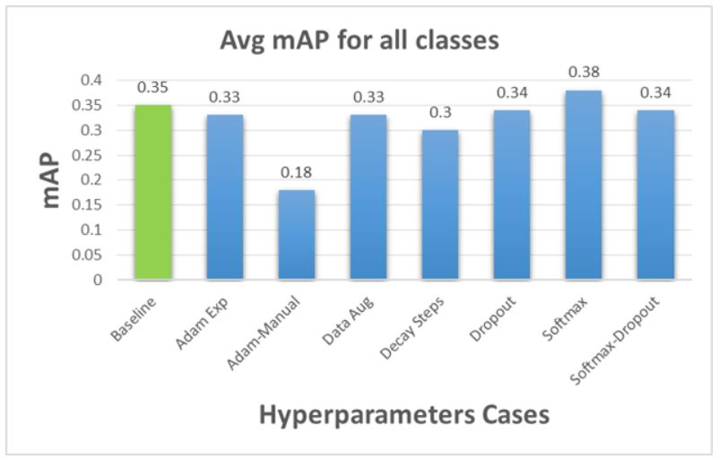
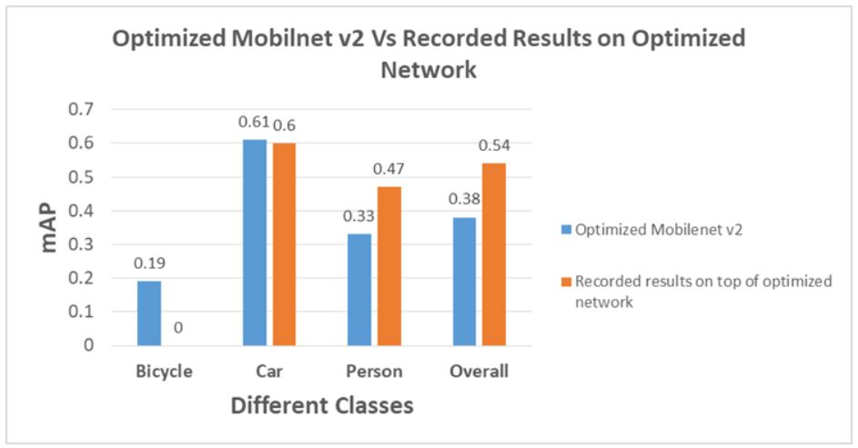

# Results of Recorded Data

A number of tests were performed on the SSD MobileNet v2 network in order to get optimal performance in terms of speed and mAP score. The sequence of the performed tests were:

- First the baseline network of SSD MobileNet v2, which is pre-trained on Google dataset containing RGB images, was downloaded. The benefit of using this is to use transfer learning at its full potential.
- Since the old dataset contains RGB images on which the pre-trained model trained and our requirement is to train on thermal (greyscale) images, there is a necessity to have a sufficient bunch of thermal images in the dataset to ensure that transfer learning. As first part of this process, we are using FLIR thermal images for training.

- The SSD MobileNet v2 network was trained using the last checkpoint of the previously trained data (Google images) with the thermal images of FLIR. After the training, evaluation is performed on test images (thermal) to check the mean Average Precision (mAP) value. This mAP value is used as a performance indicator for our network.
- The results obtained were quite satisfactory but it is always good to tweak some important parameters (hyperparameters) to increase our network’s accuracy. So, a study was performed to evaluate the improvement in accuracy of the network based on tweaking hyperparameters.

- The results obtained shows that by changing the activation function from SIGMOID to SOFTMAX yields us the best performance as shown in figure 1.

 

**Case-1**:- Optimization of network based on hyperparameters

*Figure 1: Effect of hyperparameters on network accuracy(mAP)*

**Case 1**:- Collection of additional data and combining dataset 

In order to further improve the mAP score of the neural network model for thermal dataset it is decided to collect additional thermal images and build on top of the optimized SSD MobileNet v2 network which was with activation function SOFTMAX. Accordingly, 1548 good quality thermal images are obtained using FLIR TAU camera mounted on top of TOYOTA PRIUS vehicle during the Beta Test. Further information about the Beta Test can be found in [Beta Test Plan](../../../beta_test_plan/).

These collected images along with FLIR images are combined together and the baseline SSD MobileNet v2 network is trained only with the intuition that a larger dataset would eventually give better results.

From figure 2 it can be observed that the overall model accuracy is lesser compared to the optimized SSD MobileNet v2 model. Also there were quite unusual trends with respect to different classes which are hard to understand because the new 1548 images has only 2 classes (car, person) whereas the FLIR dataset had 3 classes (car, person and bicycle). The idea here is that since we are an adding additional dataset for car and person we should see improvement with respect to these classes but on the contrary there is an performance improvement of bicycle class and a reduction in performance with respect to person class. 

Due to this variation in results it is hard to make any conclusion about this training process.

*Figure 2: Performance comparison between 2 modified networks*

**Case 2**:- Using additional recorded data and building on top of optimized network

Another approach to improve neural network accuracy is to use the recorded data and feed it the last checkpoint of the optimized network. This approach is done due to three reasons : 

- Ideally, the camera installed on the car captures images that have the recorded quality and makes an inference on that dataset.
- The trained network has frozen weights and features extracted with respect to FLIR images which means that using this optimized network on our vehicle would perform very bad inference results as the quality and exposure of images are completely different, leading to confusing the network.

- To avoid confusing the network, we train our network with optimized hyperparameters and our recorded dataset. This will give us new weights and extracts new features which will be useful for the network to perform accurately.

From figure 3 it is observed that the network actually performs better in comparison to optimized SSD MobileNet v2 network with class person showing an improvement of 14% and bicycle class as 0% since there is no bicycle class in the trained network.

*Figure 3: Performance comparison between Optimized network Vs Recorded Results on Optimized Network*

 

 

 
