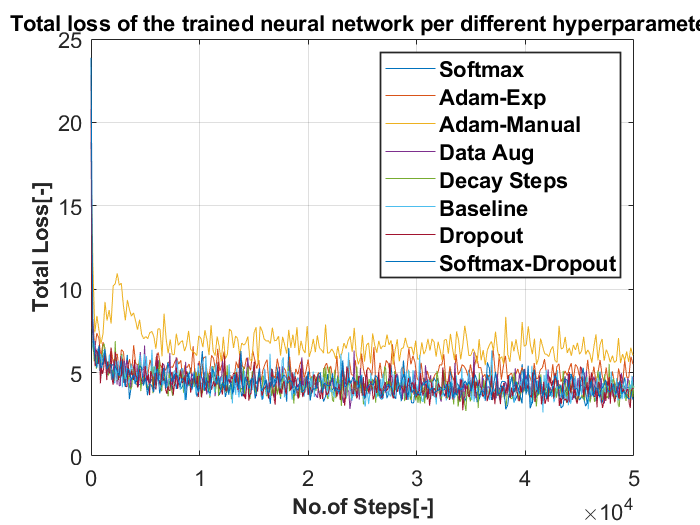
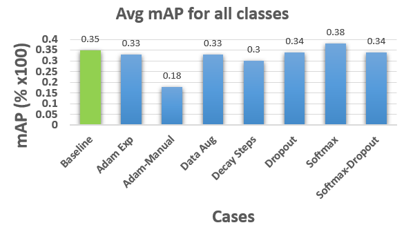
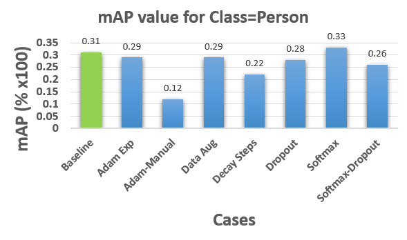
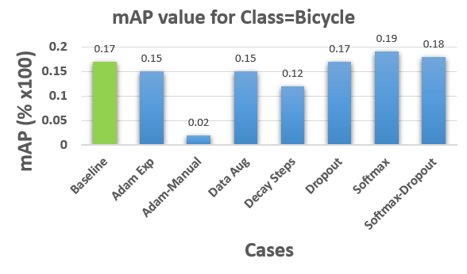
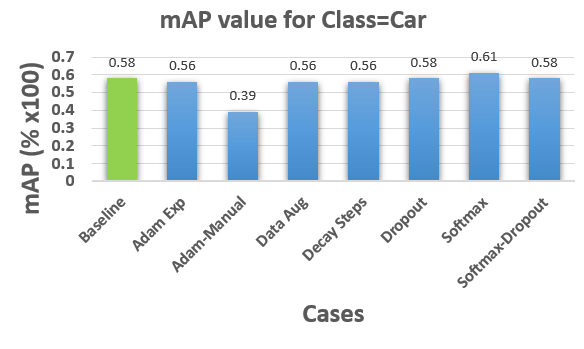

# **Tweaking and Tuning of Hyperparameters**

Training of neural network on SSD MobileNet v2 was performed on Flir dataset which contains 8862 images as the training set and 1366 images as the test set. To check the influence of hyperparameters on the model’s accuracy we have varied 1 hyperparameter at a time with respect to the baseline hyperparameters set in the configuration file and then evaluated the mean average precision(mAP) scores [Evaluation Metric](../evaluation_metric/README.md). The following hyperparameters were varied: 

The baseline configuration file has a number of hyperparameters which can be varied they are namely: activation functions, IoU thresholds, optimizer functions, learning rate, epsilon and decay value etc. The list is very exhaustive and this can lead to 'n' number of parameters to choose for tuning our network and the process can go on forever.

Based on different network architectures it was observed that most the hyperparameters mentioned earlier are internal features(layers) of the network. So,varying these parameters will not make a significant effect on the overall performance of the network. Hence, a very selective choice of hyperparameters were chosen which would improve the overall performance of the network and the rest were disregarded.

Table 1 indicates the choice of hyperparameters considered with their initial value and the replaced value(new).  

| Sl.No |   Hyperparameter    |  Initial Value  | Replaced Value                                               |
| ----- | :-----------------: | :-------------: | :----------------------------------------------------------- |
| 1.    | Activation function |     SIGMOID     | SOFTMAX                                                      |
| 2.    |      Optimizer      |       RMS       | 1. Adams with Manual Learning rate                                              2. Adams with exponential Learning rate |
| 3.    |  Data Augmentation  | Horizontal Flip | Black Patches                                                |
| 4.    |     Decay Steps     |     800756      | 5000                                                         |
| 5.    |       DROPOUT       |       OFF       | ON                                                           |

*Table 1: Hyperparameters replaced with the default ones in the neural network architecture*

The reason to change the default hyperparameter values to the proposed values are explained further.

**1.** **SIGMOID** to **SOFTMAX** – Sigmoid functions are generally used and preferred for 2 class logistic regression whereas SoftMax function is applicable for multi class logistic regression. This means that if a detection system is having no. of classes > 2, we would use SoftMax function and if no. of classes < 2, then we would use Sigmoid function. SoftMax function basically works on weighted probability distribution function with respect to their class whereas Sigmoid function hardcodes/assigns either 1 or 0 to the input classes.

Let’s say, we have three classes {class-1, class-2, class-3} and scores of an item for each class is [1, 7, 2].

Sigmoid assigns the probability [0, 1, 0] whereas SoftMax assigns probability [0.1, 0.7, 0.2]. Hence, SoftMax predicts softly (with probability 0.7) that item belongs to class-2 whereas Sigmoid predicts hardly (with probability 1) that item belongs to class-2.

**2.** **RMS PROP** to **ADAMS** – RMS PROP is an optimizer that searches for global minima by performing rapid oscillations about points obtained from learning rate value. To minimise this frequency of oscillation we combine RMS PROP with momentum optimizer, which is another optimizer used to reduce frequency of oscillations. Hence we are using two optimisers at different levels, on the other hand we have ADAM optimiser which is capable enough of handling both this function of impeding towards global minima with minimum oscillation making the optimization process smoother.

**Additional information**

Again optimization process depends upon the value at which the network is learning and taking steps. This can be done in 2 ways having a fixed learning rate (preferably small so that we take baby steps towards global minima) or exponential rate where we set a default initial learning rate for few number of steps and then beyond that the network is dynamically adjusting its weight based on what it learns.

**3.** **Data Augmentation** – Whenever we have a limited dataset and would like to increase this dataset in order to have sufficient data for training the network we usually perform data augmentation. This is nothing but adding additional test scenarios for the network to learn and classify a class. So our idea was to add noise (gaussian) to our dataset so that our network could predict even in the worst case scenario but gaussian noise wasn’t supported in our network script so we add black patches which is loss of data which can be seen as a complimentary function to noise.

**4.** **Decay Steps** – This function defines the number of steps after which our learning rate should decrease. Based on the default configuration value we observe that the learning rate is fixed, this value will never change since our network is trained a maximum for 200k steps. This indicates that decay steps is never used in the configuration file if you restrict your training to 200k steps. The 200k steps is taken here(by Google) because beyond these steps there wasn't any significant change in the networks performance. To facilitate the network to learn dynamically we changed it to 5000 which means that after every 5000 steps the learning rate will be modified and adjusted accordingly to the networks behaviour.

**5.** **Dropout** – The basic function of dropout is to deactivate a few neurons in the network (randomly) which helps in avoiding over-fitting of the data, this helps the network in learning in a more random manner rather than following a fixed trend. This value is ‘OFF’ in the default case and we would like our network to learn in random manner and hence we tested it for ’ON’ case.

###   Results

A common way to evaluate a networks performance is based on the "total loss" value (difference in the predicted value and the actual value) and [mAP Value](../evaluation_metric/README.md). A similar approach is adopted here by evaluating the total loss and mAP values for each of our tuned hyperparameters.

### 1.)**Total Loss**

Figure 1 illustrates the total loss (difference in the predicted value and the actual value) of the neural network during the training per each hyperparameter. Depending on the obtained results, one can conclude that the training loss decreases as we increase the number of training steps. By changing different hyperparameters (indicated by different colours in the graph) we can see the difference in the pattern of training losses.



*Figure 1: Total loss of the trained neural network per different hyperparameter*

### 2.) **Average mAP Values**

Figure 2 depicts the mAP value evaluated for each hyperparameter changed individually. The results of trained neural network(MobileNet V2 SSD) with different hyperparameters are shown in the figure, together with the baseline result, indicated in the green colour.




 *Figure 2: Average mAP value of all classes for the trained neural network per different hyperparameters*

### 3.) **mAP for Person**

Figure 3 illustrates the mAP value evaluated for each hyperparameter changed individually. This is particularly evaluated for one of our classes which is 'person' and compared with the baseline result indicated in green colour in the figure below.



 *Figure 3: Average mAP value of person for the trained neural network per different hyperparameters*

### 4.) **mAP for Bicycle**

Figure 4 depicts the mAP value evaluated for each hyperparameter changed individually. This is particularly evaluated for one of our classes which is 'Bicycle' and compared with the baseline result indicated in green colour in the figure below.



 *Figure 4: Average mAP value of bicycle for the trained neural network per different hyperparameters*

### 5.) **mAP for Car**

Figure 5 shows the mAP value evaluated for each hyperparameter changed individually. This is particularly evaluated for one of our classes which is 'car' and compared with the baseline result indicated in green colour in the figure below.



 *Figure 5: Average mAP value of car for the trained neural network per different hyperparameters*


### Conclusion

Based on the results depicted in the figures 1,2,3,4,5 for total loss and mAP, one can conclude that **DROPOUT** and **SOFTMAX** feature improved our model accuracy by close to 3% while the other parameters yielded no significant differences in mAP value but **ADAM optimizer** with manual learning rate ended up with worst results.

 Hence, the final hyperparameter settings used for our configuration file for training our network were set as follows in the config file:

```
model {
ssd {
num_classes: 3
box_coder {
faster_rcnn_box_coder {
y_scale: 10.0
x_scale: 10.0
height_scale: 5.0
width_scale: 5.0
}
}
matcher {
argmax_matcher {
matched_threshold: 0.5
unmatched_threshold: 0.5
ignore_thresholds: false
negatives_lower_than_unmatched: true
force_match_for_each_row: true
}
}
similarity_calculator {
iou_similarity {
}
}
anchor_generator {
ssd_anchor_generator {
num_layers: 6
min_scale: 0.2
max_scale: 0.95
aspect_ratios: 1.0
aspect_ratios: 2.0
aspect_ratios: 0.5
aspect_ratios: 3.0
aspect_ratios: 0.3333
}
}
image_resizer {
fixed_shape_resizer {
height: 300
width: 300
}
}
box_predictor {
convolutional_box_predictor {
min_depth: 0
max_depth: 0
num_layers_before_predictor: 0
use_dropout: false
dropout_keep_probability: 0.8
kernel_size: 1
box_code_size: 4
apply_sigmoid_to_scores: false
conv_hyperparams {
activation: RELU_6,
regularizer {
l2_regularizer {
weight: 0.00004
}
}
initializer {
truncated_normal_initializer {
stddev: 0.03
mean: 0.0
}
}
batch_norm {
train: true,
scale: true,
center: true,
decay: 0.9997,
epsilon: 0.001,
}
}
}
}
feature_extractor {
type: 'ssd_mobilenet_v2'
min_depth: 16
depth_multiplier: 1.0
conv_hyperparams {
activation: RELU_6,
regularizer {
l2_regularizer {
weight: 0.00004
}
}
initializer {
truncated_normal_initializer {
stddev: 0.03
mean: 0.0
}
}
batch_norm {
train: true,
scale: true,
center: true,
decay: 0.9997,
epsilon: 0.001,
}
}
}
loss {
classification_loss {
weighted_sigmoid {
}
}
localization_loss {
weighted_smooth_l1 {
}
}
hard_example_miner {
num_hard_examples: 3000
iou_threshold: 0.99
loss_type: CLASSIFICATION
max_negatives_per_positive: 3
min_negatives_per_image: 3
}
classification_weight: 1.0
localization_weight: 1.0
}
normalize_loss_by_num_matches: true
post_processing {
batch_non_max_suppression {
score_threshold: 1e-8
iou_threshold: 0.6
max_detections_per_class: 100
max_total_detections: 100
}
score_converter: SOFTMAX
}
}
}

train_config: {
batch_size: 16
optimizer {
rms_prop_optimizer: {
learning_rate: {
exponential_decay_learning_rate {
initial_learning_rate: 0.004
decay_steps: 800720
decay_factor: 0.95
}
}
momentum_optimizer_value: 0.9
decay: 0.9
epsilon: 1.0
}
}
fine_tune_checkpoint: "Path_to_checkpoint_DIR/model.ckpt"
fine_tune_checkpoint_type:  "detection"

num_steps: 200000
data_augmentation_options {
random_horizontal_flip {
}
}
data_augmentation_options {
ssd_random_crop {
}
}
}

```

